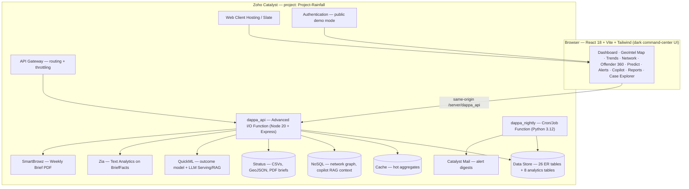

# KSP DAPPA

**Karnataka State Police — Data Analytics & Predictive Policing Assistant**

> *From Records to Foresight.* (ದತ್ತಾಂಶದಿಂದ ದೂರದೃಷ್ಟಿಗೆ)

KSP DAPPA turns the SCRB's siloed, Excel-bound FIR records into a live
strategic-intelligence hub: an interactive geospatial command center that
detects crime hotspots, uncovers hidden criminal networks, resolves repeat
offenders across jurisdictions, forecasts emerging risks, and answers
plain-English questions — built end-to-end on **Zoho Catalyst**, on the
**official KSP FIR database schema**.

Submission for **KSP Datathon 2026**, challenge *"AI-Driven Crime Analytics &
Visualization Platform."*


---

## Highlights

- **Official ER schema, verbatim.** Every table, key, and the structured
  `CrimeNo` format (`1-digit category · 4-digit district · 4-digit station ·
  4-digit year · 5-digit serial`) from the organizer-supplied ER diagram is
  implemented in Catalyst Data Store — the FIR detail view even renders the
  18-digit breakdown.
- **Identity resolution across jurisdictions.** The Accused table has no person
  ID (faithful to the real schema); DAPPA links "Ravi Kumar", "Ravi Kumar B"
  and "R Kumar" across districts into one Offender-360 profile with an MO
  signature — the "impossible in isolated Excel sheets" moment, made visible.
- **Catalyst-native maximalism.** 15+ Catalyst services doing real work; no
  external AI, hosting, database, or auth service anywhere.
- **Demo-proof AI.** Heavy analytics (DBSCAN hotspots, Louvain communities,
  Holt-Winters forecasts) are precomputed into Data Store tables; live AI
  (QuickML, Zia, LLM/RAG copilot) sits behind feature flags with
  identical-shape local fallbacks — the app can never error mid-demo.

## Architecture



**Data flow:** the Python synthetic-data engine generates ER-faithful records →
bulk-loaded into Data Store → the analytics pass persists derived intelligence
(aggregates, hotspots, forecasts, anomalies, network, offender profiles,
station risk) → the API serves precomputed intel in milliseconds via Cache →
the UI renders. Live AI calls are on-demand, flag-gated, with fallbacks.

## Features

| Challenge requirement | DAPPA screen | How |
|---|---|---|
| Interactive geospatial dashboards | Command Dashboard + GeoIntel Map | Choropleth of 38 police units, district → station → FIR drill-down |
| Spatiotemporal hotspots | Hotspot layer | ST-DBSCAN over lat/lng × hour-of-day ("Night burglary belt — Peenya, 11PM–3AM") |
| Emerging-trend alerts, red-zone pulsing | Alerts + pulsing map badges | Weekly counts vs 8-week seasonal baseline; z ≥ 2 → animated red pulse |
| Relationship mapping | Network Explorer | Co-accused graph, Louvain communities ("Group #7 · 9 members · 4 districts") |
| Repeat-offender tracking + MO | Offender 360 | Fuzzy identity resolution + MO signature from FIR narratives |
| Socio-economic correlation | Context panel | District crime rates × urbanization/literacy/density, correlation matrix |
| Predictive risk scoring | Predict | 30-day station risk index + QuickML case-outcome model, live |
| Anomaly detection | Alerts + case flags | Robust z-scores + IsolationForest case-level outliers |
| Pattern & trend discovery | Trends | Hour×weekday seasonality, festival-window annotations, forecasts with CI |
| Natural-language analytics | Ask DAPPA copilot | QuickML LLM + RAG, deterministic NL→ZCQL fallback, chart + ZCQL reveal |
| Strategic intelligence delivery | Reports | One-click SmartBrowz Weekly Intelligence Brief PDF, Catalyst Mail digest |

## Catalyst services used

| # | Service | Use in DAPPA |
|---|---|---|
| 1 | Web Client Hosting / Slate | React SPA hosting (same-origin `/server` → zero CORS) |
| 2 | Functions — Advanced I/O | `dappa_api` Express REST API |
| 3 | Functions — Cron/Job | `dappa_nightly` Python analytics refresh |
| 4 | Signals + Event Functions | New-FIR insert → incremental aggregate + anomaly check |
| 5 | Data Store (+ ZCQL) | Official ER schema + 8 analytics tables |
| 6 | NoSQL | Network graph snapshots; copilot RAG context |
| 7 | Stratus | Raw datasets, GeoJSON, generated PDF briefs |
| 8 | Cache | KPI/choropleth aggregates (ms-level dashboard) |
| 9 | QuickML (tabular) | Case-outcome classifier endpoint |
| 10 | QuickML LLM Serving + RAG | "Ask DAPPA" natural-language copilot |
| 11 | Zia Text Analytics | NER/keywords/sentiment → MO tags from `BriefFacts` |
| 12 | SmartBrowz | Weekly Intelligence Brief PDF |
| 13 | Catalyst Mail | Anomaly alert digests |
| 14 | Authentication | Officer login + public read-only demo mode |
| 15 | API Gateway | Routing/throttling in front of `dappa_api` |
| 16 | Pipelines (CI/CD) | Auto build-and-deploy from `main` |

Stretch (roadmap): Circuits, ConvoKraft — see [`docs/ROADMAP.md`](docs/ROADMAP.md).

## Quickstart

### Prerequisites

- **Node ≥ 20** and npm
- **Python 3.12** — on this project's dev machine the interpreter is invoked as
  `python3.12` (plain `python` may resolve elsewhere); packages: pandas, numpy,
  scikit-learn, networkx, scipy, statsmodels, rapidfuzz, faker
- **Catalyst CLI** ≥ 1.27 (`npm i -g zcatalyst-cli`), logged in
  (`catalyst login`) with access to the Catalyst project

### 1. Generate the synthetic dataset + analytics

```bash
python3.12 pipeline/generate.py            # ~45k FIRs, deterministic (--seed 2026)
python3.12 pipeline/analytics.py           # hotspots, forecasts, anomalies, network, risk
```

Scale down with `DAPPA_SCALE=15000` if imports are slow. Outputs land in
`pipeline/out/` (one CSV per Data Store table + QuickML training files +
RAG context).

### 2. Bulk-load the Data Store

```bash
node scripts/bulk_load.js                  # resumable; skips tables already loaded
node scripts/verify_load.mjs               # row counts vs CSVs + 5 spot joins
```

### 3. Run locally

```bash
cd client && npm install && cd ..
catalyst serve                             # app on :3000, API under /server/dappa_api
node scripts/smoke_test.mjs http://localhost:3000
```

### 4. Deploy

```bash
cd client && npm run build && cd ..
catalyst deploy                            # functions + web client
node scripts/warmup.mjs <deployed URL>     # prime the cache
node scripts/smoke_test.mjs <deployed URL> # full smoke suite (must be green)
```

Live Catalyst AI (QuickML, LLM/RAG, Zia, SmartBrowz, Mail) is enabled through
console procedures in [`docs/CONSOLE_SETUP.md`](docs/CONSOLE_SETUP.md); until
then every feature runs on its documented local fallback.

## Environment variables

Set on the `dappa_api` function (console → Functions → dappa_api →
Configuration); `.env.example` mirrors this table. All flags default **off** —
the app is fully functional on fallbacks.

| Variable | Meaning |
|---|---|
| `PUBLIC_DEMO` | `true` (default) = read-only anonymous access for judges; admin actions gated |
| `FEATURE_QUICKML` | `on` = score `POST /predict/outcome` via the deployed QuickML endpoint; off = embedded logistic-regression coefficients (`meta.source:"fallback-local"`) |
| `QUICKML_OUTCOME_URL` | QuickML tabular model endpoint URL |
| `CATALYST_QUICKML_KEY` | API key for QuickML endpoints |
| `FEATURE_QUICKML_LLM` | `on` = copilot uses QuickML LLM Serving + RAG; off = deterministic NL→ZCQL parser |
| `QUICKML_LLM_URL` | QuickML LLM Serving endpoint URL |
| `FEATURE_ZIA` | `on` = Zia Text Analytics on FIR narratives; off = local regex/TF-IDF extractor |
| `FEATURE_SMARTBROWZ` | `on` = SmartBrowz renders the weekly-brief PDF; off = print-CSS route |
| `FEATURE_MAIL` | `on` = Catalyst Mail digests enabled |
| `MAIL_FROM` | Verified from-address for Catalyst Mail |
| `DIGEST_TO` | Recipient for the alert digest |
| `DAPPA_SCALE` | Generator scale knob (default 45000 cases) |
| `DAPPA_OUT` | Pipeline input/output dir (default `pipeline/out`) |
| `VITE_API_BASE` | Client dev override for the API base (default `/server/dappa_api/api/v1`) |

## API overview

Base path: `/server/dappa_api/api/v1`. Envelope: `{"ok":true,"data":…,"meta":…}`
(errors: `{"ok":false,"error":{code,message}}`). Common filters
`from,to,districtId,unitId,crimeHeadId,crimeSubHeadId,gravityId`; pagination
`page`/`perPage` (≤200).

| Endpoint | Purpose |
|---|---|
| `GET /healthz` | Data Store / Cache / NoSQL reachability + row counts |
| `GET /meta/lookups` | Districts, unit hierarchy, crime heads/subheads, statuses (cached 1 h) |
| `GET /summary/kpis` | Total FIRs, MoM %, heinous, detection rate, active alerts, top riser |
| `GET /trends/monthly` · `/trends/seasonality` · `/trends/category-share` | Trend lines, hour×weekday matrix, category share |
| `GET /geo/districts` · `/geo/stations` · `/geo/incidents` · `/geo/hotspots` | Choropleth, station bubbles, heat points, hotspot clusters |
| `GET /alerts` · `POST /alerts/:id/ack` | Emerging-trend anomaly alerts + acknowledge |
| `GET /network/graph` | Co-accused network (nodes/edges, communities) |
| `GET /offenders` · `/offenders/:personKey` | Identity-resolved offender profiles + Offender 360 |
| `GET /forecast` | History + 3-month forecast with 80% CI + backtest MAPE |
| `GET /risk/stations` | Next-30-day station risk scores with drivers |
| `GET /cases` · `/cases/:id` | Case explorer + full-ER FIR detail |
| `POST /predict/outcome` | Case-outcome probability (QuickML or local fallback) |
| `POST /ai/narrative` | Zia NER/keywords/sentiment on `BriefFacts` |
| `POST /copilot/query` | Ask-DAPPA natural-language analytics |
| `POST /reports/weekly-brief` | SmartBrowz PDF of the weekly intelligence brief |

## Data ethics & disclaimer

- **All data is synthetic.** Generated by `pipeline/generate.py` (deterministic,
  seed 2026) with fictional Kannada-region names; no real person, case, or
  record is represented. A visible banner in the UI states this at all times.
- **Caste and religion are never model inputs.** These fields exist in the
  schema for fidelity to the official ER diagram, but are excluded from every
  ML feature set, analytics output, and UI analytics — by contract, enforced in
  the pipeline and API.
- District boundaries are 2011-census polygons; socio-economic figures are
  indicative census-like values, labelled as such in the UI.

## Repository layout

```
client/            React 18 + Vite + Tailwind SPA (dark command-center UI)
functions/
  dappa_api/       Advanced I/O function — Node 20 + Express REST API
  dappa_nightly/   Cron/Job function — Python analytics refresh
pipeline/          generate.py (synthetic ER data) + analytics.py (derived intel)
data/geo/          Karnataka districts GeoJSON (23 KB, 30 features)
scripts/           bulk_load.js · verify_load.mjs · smoke_test.mjs · warmup.mjs
docs/              ER diagram, CONTRACTS, CONSOLE_SETUP, DECISIONS, ROADMAP,
                   screenshots/, benchmarks/
```

## License

MIT — see [`LICENSE`](LICENSE). The repository is public per datathon rules;
the MIT license keeps reuse rights clear.

## Team

<!-- Team section — fill before submission -->
| Name | Role | Contact |
|---|---|---|
| _TBD_ | Team lead | _TBD_ |

---

*KSP Datathon 2026 · built on Zoho Catalyst · synthetic demonstration data only.*
