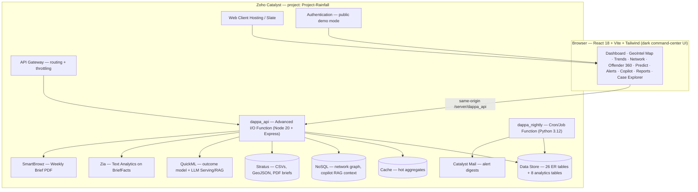
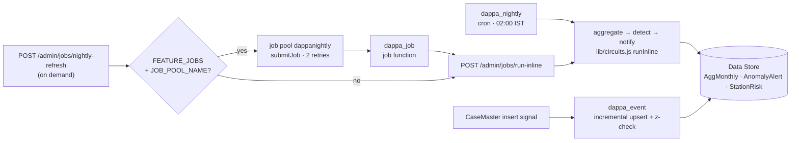

# KSP DAPPA

**Karnataka State Police — Data Analytics & Predictive Policing Assistant**

> *From Records to Foresight.* (ದತ್ತಾಂಶದಿಂದ ದೂರದೃಷ್ಟಿಗೆ)

KSP DAPPA turns the SCRB's siloed, Excel-bound FIR records into a live
strategic-intelligence hub: an interactive geospatial command center that
detects crime hotspots, uncovers hidden criminal networks, resolves repeat
offenders across jurisdictions, forecasts emerging risks, and answers
plain-English questions — built end-to-end on **Zoho Catalyst**, on the
**official KSP FIR database schema**.

Submission for **KSP Datathon 2026**, challenge *"AI-Driven Crime Analytics &
Visualization Platform."*


## Contents

**Using it** · [Try it](#try-it) · [Highlights](#highlights) ·
[Architecture at a glance](#architecture-at-a-glance) · [Features](#features) ·
[**How to use it**](#how-to-use-it) · [Challenge coverage](#challenge-coverage)

**How it works** · [**What actually runs on Zoho Catalyst**](#what-actually-runs-on-zoho-catalyst) ·
[Catalyst services used](#catalyst-services-used) ·
[**Architecture in depth**](#architecture-in-depth) · [**Workflows**](#workflows)

**Running it** · [Quickstart](#quickstart) ·
[Environment variables](#environment-variables) · [API overview](#api-overview)

**About the work** · [**What I did**](#what-i-did) ·
[Data ethics & disclaimer](#data-ethics--disclaimer) ·
[Repository layout](#repository-layout) · [License](#license) · [Team](#team)

## Try it

| What | Where | Notes |
|---|---|---|
| **Live app** (Zoho Catalyst) | https://project-rainfall-60079891305.development.catalystserverless.in/app/index.html | The real deployment: 45,000 synthetic FIRs in the Catalyst Data Store, every Catalyst service the service table calls live. No sign-in — anonymous visitors get a read-only District view. |
| **Live API** | [`/healthz`](https://project-rainfall-60079891305.development.catalystserverless.in/server/dappa_api/api/v1/healthz) · [`/meta/services`](https://project-rainfall-60079891305.development.catalystserverless.in/server/dappa_api/api/v1/meta/services) | Row counts and per-table completeness; the service inventory with a status and a reason for every row. |
| **No-backend demo** (GitHub Pages) | https://golden007-prog.github.io/KSP-Dappa/ | The same client with the API answers baked in as static JSON — useful if the Catalyst deployment is asleep, and it proves the UI is not a mock. |

Judges' shortcuts inside the app: the **tier switcher** in the top bar walks from
DGP down to head constable; **`?tier=beat`** deep-links straight to the constable
view; **/about** shows every service, model and honest caveat; **/styleguide**
publishes the design tokens with their measured contrast ratios.

---

## Highlights

- **1,138 cataloged features, 412 of them analytic.** Every user-visible
  capability is enumerated in [`FEATURES.md`](FEATURES.md), each tagged with the
  scored capabilities it serves or marked infrastructure; the counts below are
  derived from those tags and checked in CI.
- **Official ER schema, verbatim.** Every table, key, and the structured
  `CrimeNo` format (`1-digit category · 4-digit district · 4-digit station ·
  4-digit year · 5-digit serial`) from the organizer-supplied ER diagram is
  implemented in Catalyst Data Store — the FIR detail view even renders the
  18-digit breakdown.
- **Identity resolution across jurisdictions.** The Accused table has no person
  ID (faithful to the real schema); DAPPA links "Ravi Kumar", "Ravi Kumar B"
  and "R Kumar" across districts into one Offender-360 profile with an MO
  signature — the "impossible in isolated Excel sheets" moment, made visible.
- **Catalyst-native maximalism.** 35 Catalyst services mapped by
  [`GET /meta/services`](https://project-rainfall-60079891305.development.catalystserverless.in/server/dappa_api/api/v1/meta/services),
  30 with a real call site. On the deployed build, measured 29 Aug 2026: **10
  live** (functions, event functions, cron, Data Store, Search, NoSQL, Stratus,
  File Store, Cache, Authentication), **9 active behind a flag** (Push, Job
  Scheduling, Zia Text Analytics, Zia OCR, Zia Face Analytics, Zia Identity
  Scanner, Zia Vision, QuickML pipelines, SmartBrowz), **2 platform** (web
  hosting, API gateway), **2 unavailable in the IN data centre** and said so
  rather than left pending (Circuits, Zia AutoML), and **12 console-pending**,
  each naming the step that would flip it. No external AI, hosting, database or auth service anywhere.
- **Demo-proof AI.** Heavy analytics (DBSCAN hotspots, Louvain communities,
  Holt-Winters forecasts) are precomputed into Data Store tables; live AI
  (QuickML, Zia, LLM/RAG copilot) sits behind feature flags with
  identical-shape local fallbacks — the app can never error mid-demo.

## Architecture at a glance



**Data flow:** the Python synthetic-data engine generates ER-faithful records →
bulk-loaded into Data Store → the analytics pass persists derived intelligence
(aggregates, hotspots, forecasts, anomalies, network, offender profiles,
station risk) → the API serves precomputed intel in milliseconds via Cache →
the UI renders. Live AI calls are on-demand, flag-gated, with fallbacks.

## Features

| Challenge requirement | DAPPA screen | How |
|---|---|---|
| Interactive geospatial dashboards | Command Dashboard + GeoIntel Map | Choropleth of 38 police units, district → station → FIR drill-down |
| Spatiotemporal hotspots | Hotspot layer | ST-DBSCAN over lat/lng × hour-of-day ("Night burglary belt — Peenya, 11PM–3AM") |
| Emerging-trend alerts, red-zone pulsing | Alerts + pulsing map badges | Weekly counts vs 8-week seasonal baseline; z ≥ 2 → animated red pulse |
| Relationship mapping | Network Explorer | Co-accused graph, Louvain communities ("Group #7 · 9 members · 4 districts") |
| Repeat-offender tracking + MO | Offender 360 | Fuzzy identity resolution + MO signature from FIR narratives |
| Socio-economic correlation | Context panel | District crime rates × urbanization/literacy/density, correlation matrix |
| Predictive risk scoring | Predict | 30-day station risk index + QuickML case-outcome model, live |
| Anomaly detection | Alerts + case flags | Robust z-scores + IsolationForest case-level outliers |
| Pattern & trend discovery | Trends | Hour×weekday seasonality, festival-window annotations, forecasts with CI |
| Natural-language analytics | Ask DAPPA copilot | QuickML LLM + RAG, deterministic NL→ZCQL fallback, chart + ZCQL reveal |
| Strategic intelligence delivery | Reports | One-click SmartBrowz Weekly Intelligence Brief PDF, Catalyst Mail digest |

## How to use it

Nothing needs to be installed to try DAPPA — open the
[live app](https://project-rainfall-60079891305.development.catalystserverless.in/app/index.html)
and you are signed in as an anonymous District-tier viewer. This section is the
tour: what each screen is *for*, and four end-to-end tasks that show the app
answering questions an officer actually has. (To run it locally instead, skip to
[Quickstart](#quickstart).)

### First: pick the rank you want to see it as

Policing questions are rank-shaped. A head constable needs three answers before
a shift; a DGP needs a state-wide risk picture. The **tier switcher** in the top
bar (Beat · Station · District · State) re-scopes every screen — the data, the
default filters and which panels appear — rather than merely hiding buttons.
`?tier=beat` deep-links to the constable view. Start there once: it is the
clearest demonstration that the app is built around who is asking.

### The screens

| Screen | What it answers | Behind it |
|---|---|---|
| **Dashboard** | "What is happening in my jurisdiction right now?" | KPIs, trend spark-lines, live alert feed |
| **GeoIntel** | "Where is crime concentrated, and when?" | Choropleth of 38 units, ST-DBSCAN hotspots, incident heat, beat map |
| **Trends** | "What is the shape of this over time?" | Monthly series, hour × weekday seasonality, category share, festival windows |
| **Network** | "Who works with whom?" | Co-accused graph, Louvain communities, victim and location entities |
| **Offenders** | "Is this the same person across districts?" | Identity resolution, Offender 360, MO signature, behavioural depth |
| **Predict** | "What is likely next?" | 30-day station risk, 3-month forecast with CI and backtest MAPE, case-outcome and case-status models |
| **Alerts** | "What changed, and did we act on it?" | Robust z-score anomalies, acknowledge/assign/escalate, and the outcome loop that scores past alerts |
| **Identify** | "Is this face already known to us?" | Bounded shortlist, Zia quality gate, 1:1 comparison, human decision, full audit |
| **Cases** | "Show me the FIR." | Case explorer, full-ER detail, the 18-digit `CrimeNo` decomposed |
| **Copilot** | "Just let me ask." | Natural-language analytics with the generated ZCQL shown |
| **Reports** | "Give me something to circulate." | Weekly intelligence brief as PDF, digest mail preview |
| **Ingest** | "Load our own extract." | CSV upload, column auto-mapping, validation, dry run |
| **About / Styleguide** | "What is real here?" | Every service with a live status; design tokens with measured contrast |

### Four tasks, end to end

**1 · Find the emerging problem, then act on it.**
Open **Alerts**. Each row is a weekly count that broke from its own 8-week
seasonal baseline (robust z ≥ 2), not a fixed threshold. Open one — the panel
shows the series, the baseline and the z-score that fired it. Acknowledge it,
assign it, or escalate; every action is written to `ActionLog` with the officer
and timestamp. Then scroll to **What happened to past alerts**: DAPPA scores its
own precision from those recorded outcomes and publishes it with a confidence
interval, so the alerting is judged by its hit rate rather than assumed correct.

**2 · Resolve one offender across jurisdictions.**
Open **Offenders** and search a common name. The official ER schema gives the
Accused table no person ID, so "Ravi Kumar", "Ravi Kumar B" and "R Kumar" are
three unrelated rows in the source data. DAPPA's identity resolution merges them
into one profile keyed on name, demographics and co-offending; open it and the
**Offender 360** shows the merged case history across districts, the MO
signature extracted from FIR narratives, the co-accused crew, and — under
**behavioural depth** — escalation, recidivism intervals and MO evolution. This
is the answer that isolated Excel sheets structurally cannot give.

**3 · Ask a question in English (or Kannada) and check the app's work.**
Open **Copilot** and ask *"top 5 districts for vehicle theft this year"*. You get
an answer, a chart, and — this is the point — a **Show ZCQL** toggle that reveals
the exact query executed. Every number in the prose is checked against the query
result by a numeric firewall before rendering: a figure the data does not support
is refused rather than shown. When the LLM path is off or unreachable, a
deterministic parser answers from the same live aggregates and says so in
`meta.source`. The copilot is never allowed to be fluent and wrong.

**4 · Run a face search the way the rules require.**
Open **Identify**. Supply a still image — your own, or **Use a sample capture**
from the synthetic gallery. A case/FIR number and a legal basis are mandatory
before the button enables (rule R6), and at least one filter must narrow the
gallery, because a whole-gallery sweep is exactly what the rules forbid (R3).
Run it: Zia Face Analytics gates image quality first, the shortlist is compared
1:1, and results come back **ranked with a similarity floor** — below it you get
*no reliable match* rather than a best guess. Record your decision; it lands in
the audit trail. The model card and the rules are on their own tabs, and the
banner never stops saying the gallery is synthetic and a match is a lead, not
evidence of identity.

### Reading the app honestly

Three habits make DAPPA legible to a sceptic, and they are worth knowing before
you judge any screen:

- **`meta.source` on every answer.** Every API response names the engine that
  produced it — `catalyst-jobs`, `zia-identity-scanner`, `quickml`,
  `fallback-local`, `local-descriptor`. When a live AI service is off or times
  out, the fallback answers *and says so*; the UI surfaces it rather than
  hiding the substitution.
- **`/about` lists all 35 Catalyst services** with a live status and, for
  anything not live, the exact reason and the step that would change it.
- **`/healthz` publishes per-table completeness.** If a load is partial the app
  says which table and by how much instead of drawing a confident empty chart.

## Challenge coverage

[`CAPABILITIES.md`](CAPABILITIES.md) is the auditable map from the six scored
capabilities of the challenge to the features backing each one — with the
verbatim requirement, the route or endpoint where a judge can see it working,
the numbered feature list from [`FEATURES.md`](FEATURES.md), and an honest count.

| Capability | Features | Bar |
|---|---:|---|
| C1 · Advanced Visualization | 152 | clears 100 |
| C2 · Criminological Network & Link Analysis | 90 | short by 10 |
| C3 · Sociological & AI-Driven Predictive Dashboards | 97 | short by 3 |
| C4 · Pattern & Trend Discovery | 108 | clears 100 |
| C5 · Network & Behavioural Analysis | 57 | short by 43 |
| C6 · AI/ML-Driven Intelligence | 85 | short by 15 |

Two capabilities clear the 100-feature bar under the Round-2 counting rules and
four do not; each gap is named in [§ Shortfall](CAPABILITIES.md#shortfall), and
C3's shortfall of three is published as *too close to call* rather than rounded
up. Of the 1,138 catalogued entries, 412 deliver analytic or visual substance
(589 attributions across the six capabilities) and 725 are enabling
infrastructure (app shell, filters, exports, error handling, print plumbing,
i18n) that is deliberately **excluded** from these counts. Nothing is counted
twice in silence: the full [overlap matrix](CAPABILITIES.md#overlap) and the
41 [backend-only endpoints](CAPABILITIES.md#backend-only) are published, and
`node scripts/check_capabilities.mjs` re-derives every number from the catalog
tags so it can be checked rather than taken on trust.

Before these numbers were published they were **audited adversarially**: nine
independent reviewers were briefed to refute the Round-2 claims against the
running code rather than confirm them, and two further reviewers tried to knock
down each finding they raised. Four findings were refuted and dropped; of the 53
that survived, every one that touched this scorecard moved a line *down* — from
scored to infrastructure. The method and the numbers it produced are in
[§ Verification](CAPABILITIES.md#verification).

## What actually runs on Zoho Catalyst

Everything except the browser. There is no external AI, hosting, database, auth
or queue anywhere in the code — the single outbound request the app makes is for
OpenStreetMap raster tiles, declared in
[§ Data ethics](#data-ethics--disclaimer) and switchable off. This section is
the map of what lives where.

### The four deployables

`catalyst.json` names four function targets plus the web client, and
`node scripts/deploy.mjs` ships all five in one pass:

| Deployable | Type | Stack | Job |
|---|---|---|---|
| `dappa_api` | Advanced I/O function | Node 20 | The whole REST API — Express, 132 paths, every Catalyst SDK call |
| `dappa_event` | Event function | Node 20 | Fires on a `CaseMaster` insert signal: incremental `AggMonthly` upsert, then a robust z-check that can write an `AnomalyAlert` |
| `dappa_nightly` | Cron function | Python 3.12 | 02:00 IST analytics refresh — `AggMonthly` delta, weekly z-scores, `StationRisk`, forecast, refresh stamp |
| `dappa_job` | **Job** function | Node 20 | The target a Catalyst job pool invokes, so the nightly refresh can be run on demand with retries and console tracking |
| `client/dist` | Web Client Hosting | — | The React SPA, served same-origin with the API |

`dappa_job` exists because a Function job pool can only invoke a function whose
deployment type is `job`. Pointing it at the cron-typed `dappa_nightly` fails
with *"The given function is not a job function."* — and because a failed submit
deliberately falls back to running the same steps inline, that failure is
invisible unless you actually submit one. It is written up in
[D-026](docs/DECISIONS.md); the short version is that an honest fallback is not
a substitute for exercising the real path.

### Where the data lives

- **Data Store** is the system of record: the 26 tables of the official ER
  diagram plus 8 derived analytics tables. Every read goes through
  `lib/datastore.js`, which builds ZCQL and pages at 300 rows. ZCQL has three
  sharp edges worth knowing — wildcards are `*` and `?`, not `%`; doubles must
  be sent as strings; `perPage` caps at 200.
- **Data Store Search** backs `/search/cases` over the columns whose Search
  Index constraint is enabled in the console; with the flag off the identical
  columns are swept with ZCQL `LIKE` and the results merged and deduped.
- **NoSQL** holds the association-graph snapshot the Network Explorer reads.
- **Stratus** holds the graph snapshot, rendered brief PDFs and archived
  artefacts, and issues pre-signed URLs.
- **File Store** holds brief artefacts in a console-created folder.
- **Cache** wraps every expensive aggregate; 20 routes carry an explicit TTL
  from 120 s to 900 s, defaulting to 600 s.

### Where the intelligence comes from

Heavy analytics — DBSCAN hotspots, Louvain communities, Holt-Winters forecasts,
identity resolution — are **precomputed** by the Python pipeline into Data Store
tables. That is a deliberate demo-safety decision: the expensive maths is
already in a table before a judge clicks anything, so no screen can hang on a
model. Live AI is layered on top, flag-gated, and each has a real fallback:

| Live service | Used for | Fallback when off or unreachable |
|---|---|---|
| Zia Text Analytics | NER, keywords, sentiment on `BriefFacts` | Deterministic MO-vocabulary + TF extractor |
| Zia OCR | Reading an uploaded FIR scan | Analyse caller-supplied text, `ocrAvailable:false` |
| Zia Face Analytics | Image quality gate before any comparison | Advisory gate (decodable, dimensions, aspect) — never a fake detection |
| Zia Identity Scanner | 1:1 face comparison for the shortlist | Local descriptor engine, `meta.engine: local-descriptor` |
| QuickML | Case-status Random Forest, A-vs-C outcome | Embedded logistic model; case status returns **503** rather than a substituted answer |
| QuickML LLM + RAG | Copilot natural-language analytics | Deterministic parser over the same live ZCQL aggregates |
| SmartBrowz | Weekly brief PDF, map screenshot | Print-CSS route the browser prints itself; static map image |
| Catalyst Mail | Alert and action-loop digests | Fully rendered digest returned as `preview` and logged |
| Push | Alert escalation and assignment | No-op that logs the payload; the in-app notification centre reads the same events |

The rule the whole project is built on: **the fallback must be honest about
being a fallback.** Every response names its engine in `meta.source` or
`meta.engine`, so a substitution is visible rather than silent.

### The two services that are not available, and why we say so

**Circuits** and **Zia AutoML** are documented by Zoho as unavailable in the IN
data centre, and this project runs on `.catalystserverless.in`. Rather than
leave them as perpetual "coming soon" rows, `servicemap.js` marks them
`unavailable` with a citation into
[`docs/CATALYST_SERVICE_RESEARCH.md`](docs/CATALYST_SERVICE_RESEARCH.md).
Circuits' job — multi-step nightly orchestration — is done by Job Scheduling
instead, which is why `dappa_job` matters.

### Console objects you cannot create from code

Some Catalyst setup is console-only: a job pool, a File Store folder, a Search
Index constraint on a column, a QuickML deployment, a Zia model id. Those are
listed in [`docs/CONSOLE_SETUP.md`](docs/CONSOLE_SETUP.md), and until each is
done its service reports `console-pending` on `/meta/services` **with the exact
step named**. The provisioned ones so far include the job pool `dappanightly`
(Function, 512 MB) and the File Store folder behind `FILESTORE_FOLDER_ID`.

### Config and secrets: the injection-and-restore dance

`catalyst deploy` ships the tracked `catalyst-config.json` verbatim, so a naive
deploy would either blank whatever the console holds or commit a credential.
The rule is that **the tracked file keeps empty strings** and real values live
only in the gitignored `functions/dappa_api/.env.deploy`.
`node scripts/deploy.mjs` bridges them:

1. capture the tracked file byte-for-byte as the restore target;
2. parse `.env.deploy` and print the injected key **names** — never values;
3. `--dry-run` exits here, before anything is written;
4. refuse the deploy if `client/dist` is a `VITE_STATIC_DEMO` (GitHub Pages)
   bundle — that build fetches `demo/api/*.json`, which this script strips
   before upload, so deploying it ships a client that 404s on every call while
   the API smoke suite still passes;
5. write the secrets into the tracked file, deploy, then restore it in a
   `finally`.

Step 4 runs **before** step 5 for a reason worth stating plainly: the first
version of that guard exited *after* the secrets were written, leaving a live
endpoint key in a tracked file. The pre-commit hook caught it. The ordering is
now the fix, and a refused deploy is verified to leave the config untouched.

One consequence to know when reading statuses: `scripts/gen_service_table.mjs`
evaluates against the *tracked* config, so the committed table shows what a
fresh clone would produce (14 `console-pending`). The live deployment has two
prerequisites injected, so `GET /meta/services` reports 12. Both numbers are
correct about different things, and each says which it is.

## Catalyst services used

The table below is generated from [`functions/dappa_api/lib/servicemap.js`](functions/dappa_api/lib/servicemap.js)
by `node scripts/gen_service_table.mjs`; the contract suite fails if it drifts.
Every row names the call site, so a judge can open the file and the endpoint.

<!-- SERVICES:START — generated by scripts/gen_service_table.mjs from functions/dappa_api/lib/servicemap.js; do not edit by hand -->
**35 Catalyst services** are mapped by `GET /meta/services`; **30** have a real call site in this repository. Against the tracked configuration: 10 live, 7 active behind a flag, 2 platform, 0 flag-gated, 14 console-pending, 2 unavailable in the IN data centre. The deployed truth is always the live endpoint — the `/about` page renders it.

| # | Service | Category | Status | How DAPPA calls it | Console step / flag |
|---|---|---|---|---|---|
| 1 | Serverless Functions | compute | live | functions/dappa_api — Express app exported from index.js | — |
| 2 | Signals + Event Functions | compute | live | functions/dappa_event — AggMonthly upsert + z-check + AnomalyAlert insert | — |
| 3 | Cron / Job Scheduling | compute | live | functions/dappa_nightly — nightly analytics refresh (Python 3.12) | — |
| 4 | AppSail (managed runtime) | compute | console-pending | — (no call site) | not used — the API runs as an advanced-I/O function; no code path can enable AppSail |
| 5 | AppSail (custom OCI runtime) | compute | console-pending | — (no call site) | not used — no custom container is part of this submission |
| 6 | Signals cross-app event bus | compute | console-pending | — (no call site) | only the in-project CaseMaster signal is bound; a cross-app subscription is a console step |
| 7 | Data Store | data | live | lib/datastore.js — buildZCQL + zcql().executeZCQLQuery, paged at 300 rows | — |
| 8 | Data Store full-text Search | data | live | lib/search.js — search().executeSearchQuery over CaseMaster + OffenderProfile | `FEATURE_SEARCH` |
| 9 | NoSQL | data | live | index.js graphLoaders.nosql — nosql().getTable('dappa_network').fetchItem() | — |
| 10 | Stratus (object store) | data | live | index.js — stratus().bucket('dappa').putObject/getObject/generatePreSignedUrl | — |
| 11 | File Store | data | live | lib/artifacts.js — filestore().folder(id).uploadFile/downloadFile | `FEATURE_FILESTORE` |
| 12 | Cache | data | live | lib/cache.js — cache().segment('dappa').put/getValue | — |
| 13 | Data Store OLAP database | data | console-pending | lib/olap.js — zcql().executeOLAPQuery(sql) for the district x head x month cube and the nightly detect step | flag on but OLAP_ENABLED not set |
| 14 | Catalyst Mail | messaging | console-pending | lib/mail.js — email().sendMail({from_email,to_email,subject,content}); the action-loop digest (lib/actiondigest.js) goes through the same sendDigest | flag on but MAIL_FROM, DIGEST_TO not set |
| 15 | Push Notifications | messaging | active (flag on) | lib/push.js — pushNotification().web().sendNotification(message, recipients); an alert escalate/assign action (lib/routes/actionlog.js) pushes through the same sendPush | `FEATURE_PUSH` |
| 16 | Circuits (multi-step orchestration) | orchestration | unavailable in IN DC | lib/circuits.js — circuit().execute(CIRCUIT_ID, 'dappa_nightly_refresh') | Circuits is documented as not available in the IN data centre (docs/CATALYST_SERVICE_RESEARCH.md §3); the in-process fallback serves |
| 17 | Job Scheduling (job pool + retries) | orchestration | console-pending | lib/jobs.js — jobScheduling().job().submitJob({target_type:'Function', target_name:'dappa_job', jobpool_name, job_config:{number_of_retries, retry_interval}}) / getJob(id); functions/dappa_job is the job-typed target, because a Function pool cannot invoke the cron-typed dappa_nightly, and it calls back into /admin/jobs/run-inline | flag on but JOB_POOL_NAME not set |
| 18 | Zia Services (text analytics) | ai | active (flag on) | lib/zia.js — zia().getNERPrediction/getKeywordExtraction/getSentimentAnalysis | `FEATURE_ZIA` |
| 19 | Zia Services (OCR / scanners) | ai | active (flag on) | lib/zia.js — zia().extractOpticalCharacters(readStream, {language}) | `FEATURE_ZIA_OCR` |
| 20 | Zia Services (translation / speech) | ai | console-pending | lib/zia.js translate() — POSTs ZIA_TRANSLATE_URL (no zcatalyst-sdk-node binding in v3.4.0) | flag on but ZIA_TRANSLATE_URL not set |
| 21 | Zia Face Analytics (detection quality gate) | ai | active (flag on) | lib/faces.js qualityGate() — zia().analyseFace(readStream, {mode:'moderate'}) before any comparison | `FEATURE_FACE_ID` |
| 22 | Zia Identity Scanner (1:1 face comparison) | ai | active (flag on) | lib/faces.js ziaCompare() — zia().compareFace(galleryStream, probeStream) per shortlisted candidate (≤ FACE_ZIA_MAX_COMPARES, cached 24 h) | `FEATURE_FACE_ID` |
| 23 | Zia AutoML (tabular) | ai | unavailable in IN DC | lib/zia.js automlPredict() — zia().automl(ZIA_AUTOML_MODEL_ID, features) | Zia AutoML is documented as not available in the IN data centre (docs/CATALYST_SERVICE_RESEARCH.md §5); the in-process fallback serves |
| 24 | QuickML (no-code ML pipelines) | ai | console-pending | lib/quickml.js — quickML().predict(QUICKML_STATUS_ENDPOINT_KEY, CaseMaster columns) for case status; QUICKML_ENDPOINT_KEY / deployment URL for the A-vs-C outcome model | flag on but QUICKML_STATUS_ENDPOINT_KEY not set |
| 25 | QuickML LLM Serving + RAG | ai | console-pending | lib/routes/actions.js — POSTs QUICKML_LLM_URL with the copilot question | flag on but QUICKML_LLM_URL not set |
| 26 | SmartBrowz (PDF / screenshots) | ai | active (flag on) | index.js smartbrowz.renderBrief — smartbrowz().convertToPdf(printUrl) then Stratus put + pre-signed URL; lib/artifacts.js captureMapSnapshot — smartbrowz().takeScreenshot(mapUrl, {page_options, screenshot_options}) | `FEATURE_SMARTBROWZ` |
| 27 | Zia Services (object recognition / image moderation) | ai | active (flag on) | lib/objects.js — zia().detectObject(readStream); lib/moderation.js — zia().moderateImage(readStream, {mode}) | `FEATURE_ZIA_OBJECTS` |
| 28 | QuickML AutoML challenger | ai | console-pending | lib/challenger.js — quickML().predict(QUICKML_AUTOML_ENDPOINT_KEY, features) beside the embedded logistic champion | flag on but QUICKML_AUTOML_ENDPOINT_KEY not set |
| 29 | Catalyst Authentication | platform | live | lib/auth.js — userManagement().getCurrentUser() / getAllUsers() | `FEATURE_AUTH` |
| 30 | Connections (OAuth) | platform | console-pending | lib/routes/services.js — connections().getConnectionCredentials(CONNECTION_LINK_NAME) | flag on but CONNECTION_LINK_NAME not set |
| 31 | Slate / Web Client Hosting | platform | platform | client/dist deployed as the project web client (catalyst deploy) | — |
| 32 | API Gateway | platform | platform | app mounts both /api/v1 and /server/dappa_api/api/v1 so either routing shape resolves | — |
| 33 | Domain Mappings | platform | console-pending | — (no call site) | console-only step; the app runs on the default Catalyst domain |
| 34 | DevOps: APM + Logs | platform | console-pending | lib/observability.js — request ring buffer behind /meta/observability (Catalyst APM/Logs are console-read only; lib/apminsight in the SDK is the Site24x7 agent and needs a Site24x7 key) | enable APM under DevOps > APM in the console and set APM_ENABLED=on; /meta/observability serves in-function telemetry meanwhile |
| 35 | Pipelines (CI/CD) | platform | console-pending | — (no call site) | deployment is driven by catalyst deploy; a Pipeline is a console/repo integration step |

*Status vocabulary:* **live** — called on the default request path; **active** — flag on and configured; **flag-gated** — code path exists, flag off; **console-pending** — needs a console step no code can perform (the reason names it); **platform** — the project runs on it without an SDK call from the function; **unavailable in IN DC** — the Catalyst docs list the service as not offered in the IN data centre this project runs in, so no console step can enable it (the reason cites the research page).
<!-- SERVICES:END -->

Not yet used, honestly: **ConvoKraft** (a guided-dialogue alternative to the
Ask DAPPA copilot) is on the roadmap; nothing in the code calls it.

## Architecture in depth

The diagram above is the shape; this is the wiring. If you read one thing here,
read the request path — everything else is a detail hanging off it.

### One request, end to end

Take the Dashboard's KPI strip:

```
Browser  client/src/routes/Dashboard.jsx:311
   │       calls useKpis(params)
   ▼
Hook     client/src/lib/api.js:372  useKpis = query(['kpis', prune(params)], …)
   │       react-query; prune() drops empty filters so the cache key is stable
   ▼
Fetch    client/src/lib/api.js  apiGet('/summary/kpis', params, {signal})
   │       base = VITE_API_BASE || '/server/dappa_api/api/v1'  (same origin)
   ▼
Catalyst Web Client Hosting → Advanced I/O function dappa_api
   ▼
Express  functions/dappa_api/lib/app.js — middleware chain, then the route table
   ▼
Route    lib/routes/read.js — anchorYm(ctx.ds, null) resolves MAX(Ym) from
   │       AggMonthly so the demo survives past the data window
   ▼
Data     lib/datastore.js → zcql().executeZCQLQuery(...)   [Cache checked first]
   ▼
Envelope lib/envelope.js  ok(res, data, meta) → {"ok":true,"data":…,"meta":…}
```

Two details in that chain repay attention. `anchorYm` means the app anchors to
the newest month that exists in the data rather than to today's date, so the
demo does not quietly go blank when the synthetic window ends. And the cache is
consulted before Data Store on 20 keyed routes, which is why the dashboard
paints in milliseconds.

### The API layer

Route modules are plain files under `lib/routes/` that each export
`register(router)`; `lib/app.js` requires them in a fixed order and mounts them.
The order is load-bearing in one place — literal paths like `/network/graph` and
`/offenders/mo-evolution` must be registered ahead of the `/:id`-style param
routes, or the param route swallows them.

- **Envelope.** Success is `{ok:true, data, meta}`, failure
  `{ok:false, error:{code, message}}`. Codes in use include `NOT_FOUND`,
  `BAD_REQUEST`, `BAD_ID`, `INTERNAL`, `RATE_LIMITED`, `AUTH_REQUIRED`,
  `AI_BUDGET`, `TIER_REQUIRED` and `TOO_MANY_ROWS`.
- **Correlation.** `X-Request-Id` is set on every request (echoed if the client
  sent a sane one, minted otherwise), and `X-Response-Time` on every enveloped
  response — so a UI error toast and the Catalyst function log line share an id.
- **Caching.** `ROUTE_TTL` in `lib/envelope.js` gives 20 routes an explicit TTL
  (`/summary/kpis` 300 s; the link-analysis and seasonality aggregates 900 s;
  `/meta/refresh` and `/alerts/summary` 120 s), default 600 s. TTL is enforced
  in seconds by embedding an expiry in the stored value, because the Catalyst
  Cache API takes hours.
- **Guards.** `requireAdmin` makes writes 403 in `PUBLIC_DEMO` mode unless a
  Catalyst session or the admin token is present; `overAiBudget` caps live AI
  calls per hour (default 40) so a demo cannot be run into a bill.
- **Service handles.** `servicesFactory` in `index.js` returns `{}` if
  `catalyst.initialize` fails, and resolves most handles as lazy closures that
  call the SDK inside the request — so a service being unavailable degrades one
  endpoint instead of failing boot.

### The client layer

React 18 + Vite + Tailwind, `HashRouter` (24 routes) so deep links survive
static hosting, `zustand` for filter/tier state and `react-query` for server
state. Charts are ECharts, maps Leaflet, the network graph Cytoscape.

- **Design tokens.** Every colour, space and radius is a `--t-*` CSS variable;
  `/styleguide` renders the palette **with measured contrast ratios**, so a
  theme regression is visible rather than argued about.
- **i18n.** English and ಕನ್ನಡ, loaded per-language at runtime rather than
  bundled together; `node scripts/check_i18n.mjs` fails on a missing or orphaned
  key.
- **Accessibility.** 68 audits across route × theme × viewport run in CI via
  `client/test/a11y/axe.mjs`, gated at zero serious violations.
- **Static-demo mode.** `VITE_STATIC_DEMO=1` builds a client that reads baked
  JSON from `demo/api/*` instead of calling the API — that is what GitHub Pages
  serves. It is genuinely useful and genuinely dangerous: deploying that bundle
  to Catalyst produces a client that 404s on everything, which is why
  `deploy.mjs` now refuses it.

### The data layer

```
pipeline/generate.py   45,000 ER-faithful FIRs, deterministic (--seed 2026)
        │              synthetic names, structured 18-digit CrimeNo
        ▼
pipeline/analytics.py  hotspots (ST-DBSCAN) · communities (Louvain) ·
        │              forecasts (Holt-Winters) · anomalies (robust z) ·
        │              identity resolution · station risk
        ▼
scripts/bulk_load.js   resumable load into Data Store (skips loaded tables)
        ▼
scripts/verify_load.mjs  row counts vs CSVs + 5 spot joins
```

Caste and religion columns exist in the generated data for fidelity to the
official ER diagram and are **excluded from every ML feature set and analytics
output** — enforced in the pipeline and again in the API.

## Workflows

### Runtime: how the nightly refresh reaches the data

The same three steps — **aggregate → detect anomalies → notify** — have exactly
one implementation (`lib/circuits.js runInline`) and three ways in. That is the
design: whichever route fires, the output shape and the audit record are
identical, so the UI never has to care.



`dappa_job` calls `/admin/jobs/run-inline` and never `/admin/jobs/nightly-refresh`
— the latter submits a job, so a job calling it would recurse.

### Development: the command sequences

```bash
# 1 · Data — deterministic, so two people get the same 45,000 FIRs
python3.12 pipeline/generate.py            # DAPPA_SCALE=15000 for a faster loop
python3.12 pipeline/analytics.py

# 2 · Load
node scripts/bulk_load.js                  # resumable; skips loaded tables
node scripts/verify_load.mjs               # counts vs CSVs + spot joins

# 3 · Run
cd client && npm install && cd ..
catalyst serve                             # app :3000, API /server/dappa_api

# 4 · Check (all four must be green before a commit)
cd functions/dappa_api && npm test && cd ../..   # contract suite, 1,603 checks
node scripts/check_i18n.mjs                      # English ↔ Kannada key parity
node scripts/gen_service_table.mjs --check       # service table matches code
node scripts/check_capabilities.mjs              # counts agree in every doc

# 5 · Ship
cd client && npm run build && cd ..         # NOT build:demo — see below
node scripts/deploy.mjs                     # injects .env.deploy, restores after
node scripts/warmup.mjs  <URL>              # prime the cache
node scripts/smoke_test.mjs <URL>           # 34 live checks, must be 34/34
```

**The one trap.** `npm run build` and the static-demo build both write
`client/dist`. If you last built for GitHub Pages, `client/dist` is a bundle
that fetches `demo/api/*.json` and will 404 on Catalyst — while the API smoke
suite still passes, because the *function* is fine. `deploy.mjs` refuses that
bundle now, but the habit worth keeping is: rebuild before you deploy.

### Quality gates

Two run locally on every commit via `git config core.hooksPath scripts/hooks`:

- **Tree hygiene** — `scripts/check_tree_hygiene.mjs` deletes the zero-byte junk
  files Windows shells create when a `node -e "…"` string contains `=>`, `>`,
  `<` or `|`. (Which is why the house rule is: put scripts in files.)
- **Generated-doc freshness** — the service table, `docs/CONTRACTS.md` and the
  capability counts must match the code. A commit that changes a route or a
  service without regenerating them is rejected.

CI (`.github/workflows/pages.yml`) runs three jobs in order:

1. **test** — tree hygiene → contract suite → i18n parity → service table →
   contracts table → capability counts.
2. **a11y** — build the client in static-demo mode, then 68 axe-core audits
   across route × theme × viewport, gated at zero serious violations.
3. **build-and-deploy** — publish the static demo to GitHub Pages.

The a11y job builds with `VITE_STATIC_DEMO=1` **on purpose**: a locally-built
client with no API renders empty pages, and empty pages pass accessibility
audits trivially. Populating them with baked data is what surfaced 140 real
violations that a local run had called clean.

### Verifying a deployment for real

Three things, in this order, and none of them is optional:

```bash
node scripts/smoke_test.mjs <URL>     # 34 API checks
curl <URL>/server/dappa_api/api/v1/healthz      # per-table completeness
curl <URL>/server/dappa_api/api/v1/meta/services  # 35 rows with live statuses
```

Then **drive the actual UI**. The smoke suite exercises the API, so it stays
green while the client is broken — that is precisely how a static-demo bundle
got deployed and every page rendered as an empty shell. Clicking through the
tools is the only check that covers the seam between them.

## Quickstart

### Prerequisites

- **Node ≥ 20** and npm
- **Python 3.12** — on this project's dev machine the interpreter is invoked as
  `python3.12` (plain `python` may resolve elsewhere); packages: pandas, numpy,
  scikit-learn, networkx, scipy, statsmodels, rapidfuzz, faker
- **Catalyst CLI** ≥ 1.27 (`npm i -g zcatalyst-cli`), logged in
  (`catalyst login`) with access to the Catalyst project

### 1. Generate the synthetic dataset + analytics

```bash
python3.12 pipeline/generate.py            # ~45k FIRs, deterministic (--seed 2026)
python3.12 pipeline/analytics.py           # hotspots, forecasts, anomalies, network, risk
```

Scale down with `DAPPA_SCALE=15000` if imports are slow. Outputs land in
`pipeline/out/` (one CSV per Data Store table + QuickML training files +
RAG context).

### 2. Bulk-load the Data Store

```bash
node scripts/bulk_load.js                  # resumable; skips tables already loaded
node scripts/verify_load.mjs               # row counts vs CSVs + 5 spot joins
```

### 3. Run locally

```bash
cd client && npm install && cd ..
catalyst serve                             # app on :3000, API under /server/dappa_api
node scripts/smoke_test.mjs http://localhost:3000
```

### 4. Deploy

```bash
cd client && npm run build:catalyst && cd ..
node scripts/deploy.mjs                    # catalyst deploy with secrets injected from
                                           # functions/dappa_api/.env.deploy (never committed)
node scripts/warmup.mjs <deployed URL>     # prime the cache
node scripts/smoke_test.mjs <deployed URL> # full smoke suite (must be green)
```

`node scripts/deploy.mjs` exists because `catalyst deploy` ships the tracked
`catalyst-config.json` verbatim: every credential in that file is an empty
string in git, and the wrapper fills them from an untracked `.env.deploy` for
the duration of the deploy only. Console steps for each live Catalyst service
(QuickML, LLM/RAG, Zia, SmartBrowz, Mail, Circuits, Search columns, Production)
are in [`docs/CONSOLE_SETUP.md`](docs/CONSOLE_SETUP.md); until a step is done
the service reports `console-pending` on `GET /meta/services` and its
documented fallback serves.

Once per clone, enable the commit gate (tree hygiene + generated tables):

```bash
git config core.hooksPath scripts/hooks
```

## Environment variables

Set on the `dappa_api` function (console → Functions → dappa_api →
Configuration, or locally in `functions/dappa_api/.env.deploy` for
`scripts/deploy.mjs`). The table is generated from `lib/servicemap.js` and
`lib/flags.js` by `node scripts/gen_service_table.mjs`. Every `FEATURE_*` flag
ships **on** in the tracked config; a flag whose prerequisite is still empty
reports `console-pending` and the fallback serves — nothing errors.

<!-- ENV:START — generated by scripts/gen_service_table.mjs; do not edit by hand -->
| Variable | Kind | Controls | Default / where it is set |
|---|---|---|---|
| `FEATURE_SEARCH` | flag | Data Store full-text Search — off → ZCQL LIKE across the same columns, merged and deduped | default on; tracked config `on` |
| `FEATURE_FILESTORE` | flag | File Store — off → Stratus bucket, then an in-process memory store | default on; tracked config `on` |
| `FILESTORE_FOLDER_ID` | prerequisite | File Store; empty ⇒ `console-pending` | console step (see docs/CONSOLE_SETUP.md); set via `.env.deploy` |
| `FEATURE_OLAP` | flag | Data Store OLAP database — off → the identical structured query through the paged 300-row ZCQL path (executeZCQLQuery) | default off; tracked config `on` |
| `OLAP_ENABLED` | prerequisite | Data Store OLAP database; empty ⇒ `console-pending` | console step (see docs/CONSOLE_SETUP.md); set via `.env.deploy` |
| `FEATURE_MAIL` | flag | Catalyst Mail — off → the fully rendered digest is returned as `preview` and logged; the action-loop digest is also served as JSON and the printable /alerts/digest page | default off; tracked config `on` |
| `MAIL_FROM` | prerequisite | Catalyst Mail; empty ⇒ `console-pending` | console step (see docs/CONSOLE_SETUP.md); set via `.env.deploy` |
| `DIGEST_TO` | prerequisite | Catalyst Mail; empty ⇒ `console-pending` | console step (see docs/CONSOLE_SETUP.md); set via `.env.deploy` |
| `FEATURE_PUSH` | flag | Push Notifications — off → no-op that logs the payload and returns it as `preview`; the in-app notification centre reads the same events from /actions/recent | default off; tracked config `on` |
| `FEATURE_CIRCUIT` | flag | Circuits (multi-step orchestration) — off → Job Scheduling (lib/jobs.js, FEATURE_JOBS) submits the same nightly refresh with retries; without a job pool the identical aggregate -> detect-anomalies -> notify steps run sequentially in-process | default off; tracked config `on` |
| `CIRCUIT_ID` | prerequisite | Circuits (multi-step orchestration); empty ⇒ `console-pending` | console step (see docs/CONSOLE_SETUP.md); set via `.env.deploy` |
| `FEATURE_JOBS` | flag | Job Scheduling (job pool + retries) — off → the same three nightly steps run inline (lib/circuits.js runInline) and are reported in the job shape | default off; tracked config `on` |
| `JOB_POOL_NAME` | prerequisite | Job Scheduling (job pool + retries); empty ⇒ `console-pending` | console step (see docs/CONSOLE_SETUP.md); set via `.env.deploy` |
| `FEATURE_ZIA` | flag | Zia Services (text analytics) — off → deterministic MO-vocabulary + TF extractor | default off; tracked config `on` |
| `FEATURE_ZIA_OCR` | flag | Zia Services (OCR / scanners) — off → analyse caller-supplied text with ocrAvailable:false | default off; tracked config `on` |
| `FEATURE_ZIA_TRANSLATE` | flag | Zia Services (translation / speech) — off → pinned English↔Kannada domain glossary; unknown strings pass through untranslated | default off; tracked config `on` |
| `ZIA_TRANSLATE_URL` | prerequisite | Zia Services (translation / speech); empty ⇒ `console-pending` | console step (see docs/CONSOLE_SETUP.md); set via `.env.deploy` |
| `FEATURE_FACE_ID` | flag | Zia Face Analytics (detection quality gate) — off → advisory gate (decodable still image, dimensions, aspect) with gate.mode:'advisory' — never a fake detection | default off; tracked config `on` |
| `FEATURE_FACE_ID` | flag | Zia Identity Scanner (1:1 face comparison) — off → local descriptor engine — cosine similarity over the generator's parameter space (meta.engine local-descriptor) | default off; tracked config `on` |
| `FEATURE_ZIA_AUTOML` | flag | Zia AutoML (tabular) — off → the embedded logistic outcome model | default off; tracked config `on` |
| `ZIA_AUTOML_MODEL_ID` | prerequisite | Zia AutoML (tabular); empty ⇒ `console-pending` | console step (see docs/CONSOLE_SETUP.md); set via `.env.deploy` |
| `FEATURE_QUICKML` | flag | QuickML (no-code ML pipelines) — off → the embedded logistic outcome model (A vs C only — case status has no local twin) | default off; tracked config `on` |
| `QUICKML_STATUS_ENDPOINT_KEY` | prerequisite | QuickML (no-code ML pipelines); empty ⇒ `console-pending` | console step (see docs/CONSOLE_SETUP.md); set via `.env.deploy` |
| `FEATURE_QUICKML_LLM` | flag | QuickML LLM Serving + RAG — off → deterministic copilot parser over live ZCQL aggregates | default off; tracked config `on` |
| `QUICKML_LLM_URL` | prerequisite | QuickML LLM Serving + RAG; empty ⇒ `console-pending` | console step (see docs/CONSOLE_SETUP.md); set via `.env.deploy` |
| `FEATURE_SMARTBROWZ` | flag | SmartBrowz (PDF / screenshots) — off → print-CSS route the browser prints itself; the static map image in place of the screenshot | default off; tracked config `on` |
| `FEATURE_ZIA_OBJECTS` | flag | Zia Services (object recognition / image moderation) — off → the scene generator's own manifest tags (source:fixture) and a format/size check with verdict:unscreened | default off; tracked config `on` |
| `FEATURE_QUICKML_AUTOML` | flag | QuickML AutoML challenger — off → champion only; the challenger AUC is read from QUICKML_AUTOML_AUC (copied from the console), never computed here | default off; tracked config `on` |
| `QUICKML_AUTOML_ENDPOINT_KEY` | prerequisite | QuickML AutoML challenger; empty ⇒ `console-pending` | console step (see docs/CONSOLE_SETUP.md); set via `.env.deploy` |
| `FEATURE_AUTH` | flag | Catalyst Authentication — off → anonymous demo identity, with the admin token as the elevation path | default on; tracked config `on` |
| `FEATURE_CONNECTIONS` | flag | Connections (OAuth) — off → reports the missing connection instead of calling out; no feature depends on it | default off; tracked config `on` |
| `CONNECTION_LINK_NAME` | prerequisite | Connections (OAuth); empty ⇒ `console-pending` | console step (see docs/CONSOLE_SETUP.md); set via `.env.deploy` |
| `APM_ENABLED` | prerequisite | DevOps: APM + Logs; empty ⇒ `console-pending` | console step (see docs/CONSOLE_SETUP.md); set via `.env.deploy` |
| `QUICKML_STATUS_ENDPOINT_KEY` | prerequisite | QuickML case-status Random Forest endpoint (`POST /predict/case-status`) | published endpoint key; set via `.env.deploy`, never committed |
<!-- ENV:END -->

| Variable (not service-bound) | Meaning |
|---|---|
| `PUBLIC_DEMO` | `true` (default) = read-only anonymous access for judges; admin actions gated behind a Catalyst session or the admin token |
| `ORG_ID` | Catalyst org id, mirrored into `X_ZOHO_CATALYST_ORG_ID` at boot because the SDK needs it to send `CATALYST-ORG` to QuickML |
| `APP_BASE_URL` | Public base URL of the web client; SmartBrowz renders the printable brief from it |
| `STRATUS_BUCKET` | Stratus bucket holding the graph snapshot, rendered briefs and archived artefacts |
| `AI_TIMEOUT_MS` | Per-call timeout for every live AI service before the fallback answers (default 4000) |
| `FORCE_FIXTURE_TABLES` | Comma-separated tables to answer from the bundled fixture while a load is incomplete (empty in normal operation) |
| `DAPPA_SCALE` | Generator scale knob (default 45000 cases) |
| `DAPPA_OUT` | Pipeline input/output dir (default `pipeline/out`) |
| `VITE_API_BASE` | Client dev override for the API base (default `/server/dappa_api/api/v1`) |

## API overview

Base path: `/server/dappa_api/api/v1`. Envelope: `{"ok":true,"data":…,"meta":…}`
(errors: `{"ok":false,"error":{code,message}}`). Common filters
`from,to,districtId,unitId,crimeHeadId,crimeSubHeadId,gravityId`; pagination
`page`/`perPage` (≤200). The API registers **132 distinct paths** (134 registrations); the ones
below are the analytic core, and the full list with the service each one
exercises (`/meta/services`, `/search/cases`, `/zia/*`, `/ml/models`,
`/admin/circuit/*`, `/auth/*`, `/notify/*`, `/reports/artifacts`…) is in
[`docs/CONTRACTS.md`](docs/CONTRACTS.md). Every route is exercised by the
contract suite (`npm test` in `functions/dappa_api`, 1,603 checks).

| Endpoint | Purpose |
|---|---|
| `GET /healthz` | Data Store / Cache / NoSQL reachability + row counts |
| `GET /meta/lookups` | Districts, unit hierarchy, crime heads/subheads, statuses (cached 1 h) |
| `GET /summary/kpis` | Total FIRs, MoM %, heinous, detection rate, active alerts, top riser |
| `GET /trends/monthly` · `/trends/seasonality` · `/trends/category-share` | Trend lines, hour×weekday matrix, category share |
| `GET /geo/districts` · `/geo/stations` · `/geo/incidents` · `/geo/hotspots` | Choropleth, station bubbles, heat points, hotspot clusters |
| `GET /alerts` · `POST /alerts/:id/ack` | Emerging-trend anomaly alerts + acknowledge |
| `GET /network/graph` | Co-accused network (nodes/edges, communities) |
| `GET /offenders` · `/offenders/:personKey` | Identity-resolved offender profiles + Offender 360 |
| `GET /forecast` | History + 3-month forecast with 80% CI + backtest MAPE |
| `GET /risk/stations` | Next-30-day station risk scores with drivers |
| `GET /cases` · `/cases/:id` | Case explorer + full-ER FIR detail |
| `POST /predict/outcome` | Chargesheet A-vs-C probability (calibrated embedded logistic model) |
| `POST /predict/case-status` | Case status via the published QuickML Random Forest; `503` if the deployment is unreachable — never a substituted answer |
| `POST /ai/narrative` | Zia NER/keywords/sentiment on `BriefFacts` |
| `POST /copilot/query` | Ask-DAPPA natural-language analytics |
| `POST /reports/weekly-brief` | SmartBrowz PDF of the weekly intelligence brief |

## What I did

### Round 1 → Round 2

Round 1 (July 2026) built the working app: the synthetic ER-faithful dataset,
the analytics pipeline, the Catalyst deployment, and the twelve screens. Round 2
(27–30 August 2026) was not a feature sprint. It was a **credibility pass** —
a deliberate campaign to make every claim in this repository checkable, and to
delete the ones that were not.

The Round-2 programme ran as eleven phases, and the useful way to describe them
is by what each one *changed its mind about*:

- **Phase 0 — baseline.** Write down the ground truth before touching anything
  ([`docs/ROUND2_BASELINE.md`](docs/ROUND2_BASELINE.md)), so later claims could
  be diffed against a fixed point rather than against memory.
- **Phase 1–2 — research.** Read the Catalyst documentation properly and record
  what is actually available in the IN data centre, with citations
  ([`docs/CATALYST_SERVICE_RESEARCH.md`](docs/CATALYST_SERVICE_RESEARCH.md)).
  This is where Circuits and Zia AutoML moved from "todo" to **unavailable**,
  and where Job Scheduling was confirmed usable by an actual live call.
- **Phase 3 — console objects.** Provision what code cannot: the job pool, the
  File Store folder, the Search Index constraints.
- **Phase 4–8 — the build wave.** Officer tiers, WCAG 2.2 work and voice input,
  face identification with a bounded shortlist and an audit trail, the alert
  **action loop** (acknowledge → assign → escalate → outcome), behavioural
  depth, the new Catalyst service surfaces, and CSV ingest. 233 catalogued
  entries shipped here.
- **Phase 9 — adversarial verification.** Nine independent reviewers were
  briefed to **refute** the Round-2 claims against the running code, and two
  further reviewers tried to knock down each finding. 100 findings raised, 4
  refuted and dropped, 53 confirmed, 79 fixes landed. Every finding that touched
  the scorecard moved a line *down* — from scored to infrastructure.
- **Phase 10 — the recount and the docs.** Re-derive every number from the tags
  and publish the gaps.

### The decisions I would defend in a review

- **Precompute the heavy maths, flag the live AI.** DBSCAN, Louvain and
  Holt-Winters run in the pipeline and land in Data Store tables; live AI sits
  behind flags with real fallbacks. A demo cannot hang on a model, and no screen
  depends on a service being up.
- **Every fallback names itself.** `meta.source` / `meta.engine` on every
  response. The alternative — a silent substitution that looks like the real
  thing — is the single most dishonest thing an AI product can do.
- **Refuse rather than guess.** `/predict/case-status` returns **503** when the
  QuickML deployment is unreachable instead of answering from a local model,
  because a case-status prediction with no local twin would be a different
  answer wearing the same label. The copilot's numeric firewall refuses any
  figure the query result does not support.
- **Publish the shortfalls.** Two of six capabilities clear the 100-feature bar
  and four do not. C3 misses by three, inside the stated tolerance, and is
  published as *too close to call* rather than rounded up
  ([D-025](docs/DECISIONS.md)). Counting rules that flatter you are not counting
  rules.
- **Generate the docs from the code.** The service table, `docs/CONTRACTS.md`
  and the capability counts are derived by scripts and gated in the pre-commit
  hook and CI, because a hand-maintained table is a table that is wrong.

### The bugs worth telling you about

Four are worth naming, because each one taught the project something and each
is now covered by a test:

1. **I deployed a GitHub-Pages bundle to Catalyst.** Every API call 404'd and
   every page rendered as an empty shell — while the API smoke suite passed
   34/34, because the function was fine. Caught only by driving the live site.
   `deploy.mjs` now refuses that bundle.
2. **My own guard nearly committed a credential.** The first version of that
   refusal exited *after* the deploy secrets were written into the tracked
   config. The pre-commit hook caught it. The check now runs before the write.
3. **An accessibility fix caused a layout bug.** An `sr-only` label added to a
   table header is `position:absolute`; with no positioning context it landed at
   x=1224 and stretched a 360 px page to 1,225 px, dragging the fixed mobile tab
   bar with it.
4. **Job Scheduling was reported as configured while every submit failed.**
   Three errors in a row — a hyphenated `job_name`, then a 22-character one,
   then the real one: a Function job pool can only invoke a `job`-typed
   function, and the target was typed `cron`. Every failure was invisible
   because the fallback is deliberate and honest. Fixed by adding `dappa_job`
   and verified by an actual job running in the pool
   ([D-026](docs/DECISIONS.md)).

The thread connecting all four: **a green test suite is not a working system.**
Three of them passed every automated check at the moment they were broken. What
found them was exercising the real path — deploying, clicking, submitting — and
that is now written into the workflow above.

### Where it stands

Measured on the deployed build, 29 August 2026: 34/34 smoke checks, 1,603
contract checks, 68 accessibility audits at zero serious violations, 12/12
interactive tools driven end-to-end at both desktop and phone widths with zero
layout overflow, 100% per-table completeness across 13 tables, and 35 Catalyst
services each reporting a status with a reason. What is *not* done is listed in
[`docs/ROADMAP.md`](docs/ROADMAP.md) and in the `console-pending` rows — named,
rather than left to be discovered.

## Data ethics & disclaimer

- **All data is synthetic.** Generated by `pipeline/generate.py` (deterministic,
  seed 2026) with fictional Kannada-region names; no real person, case, or
  record is represented. A visible banner in the UI states this at all times.
- **Caste and religion are never model inputs.** These fields exist in the
  schema for fidelity to the official ER diagram, but are excluded from every
  ML feature set, analytics output, and UI analytics — by contract, enforced in
  the pipeline and API.
- District boundaries are 2011-census polygons; socio-economic figures are
  indicative census-like values, labelled as such in the UI.
- **The only outbound request the app makes is for map tiles.** Every service —
  analytics, ML, storage, auth, mail, notifications — is Zoho Catalyst; there is
  no external AI, hosting, database or auth endpoint anywhere in the code. The
  one exception is the OpenStreetMap raster basemap under the GeoIntel
  choropleth and the FIR incident map (`client/src/routes/geointel/MapCanvas.jsx`,
  `client/src/routes/cases/IncidentMap.jsx`), which the organiser rules permit as
  a client data source rather than a service (`docs/CONTRACTS.md` §Guardrails).
  It is declared here rather than left to be discovered in a network log, and it
  carries no data of ours outward — a tile request is a {z}/{x}/{y} coordinate.
  GeoIntel's **Basemap on / off** control (persisted with the other map prefs)
  turns it off entirely, and both maps show a notice instead of failing when the
  tiles do not load. Every analytic layer — choropleth, hotspots, heat, incident
  points, beat map — is drawn from bundled GeoJSON and the Catalyst API, so the
  intelligence on screen is unchanged with the basemap off.

## Repository layout

```
client/            React 18 + Vite + Tailwind SPA (command-center UI, English · ಕನ್ನಡ)
functions/
  dappa_api/       Advanced I/O function — Node 20 + Express REST API (132 paths) + contract suite
  dappa_event/     Event function — CaseMaster insert signal → AggMonthly upsert + z-check
  dappa_nightly/   Cron function — Python 3.12 nightly analytics refresh (02:00 IST)
  dappa_job/       Job function — the target a Catalyst job pool invokes (retries + console tracking)
pipeline/          generate.py (synthetic ER data) + analytics.py (derived intel)
data/geo/          Karnataka districts GeoJSON (23 KB, 30 features)
scripts/           bulk_load.js · verify_load.mjs · smoke_test.mjs · warmup.mjs · deploy.mjs ·
                   gen_service_table.mjs · check_i18n.mjs · check_tree_hygiene.mjs · hooks/
docs/              DECISIONS.md · ROADMAP.md · CONTRACTS.md · CONSOLE_SETUP.md · benchmarks/ ·
                   screenshots/ · ROUND2_BASELINE.md (engineering docs; strategy kit stays local)
video/script/      Narration, timeline and subtitles of the 3-minute demo video
FEATURES.md        Catalog of user-visible features, tagged by scored capability
CAPABILITIES.md    Audited map from the six scored capabilities to the features behind them
```

## License

MIT — see [`LICENSE`](LICENSE). The repository is public per datathon rules;
the MIT license keeps reuse rights clear.

## Team

<!-- Team section — fill before submission -->
| Name | Role | Contact |
|---|---|---|
| _TBD_ | Team lead | _TBD_ |

---

*KSP Datathon 2026 · built on Zoho Catalyst · synthetic demonstration data only.*
