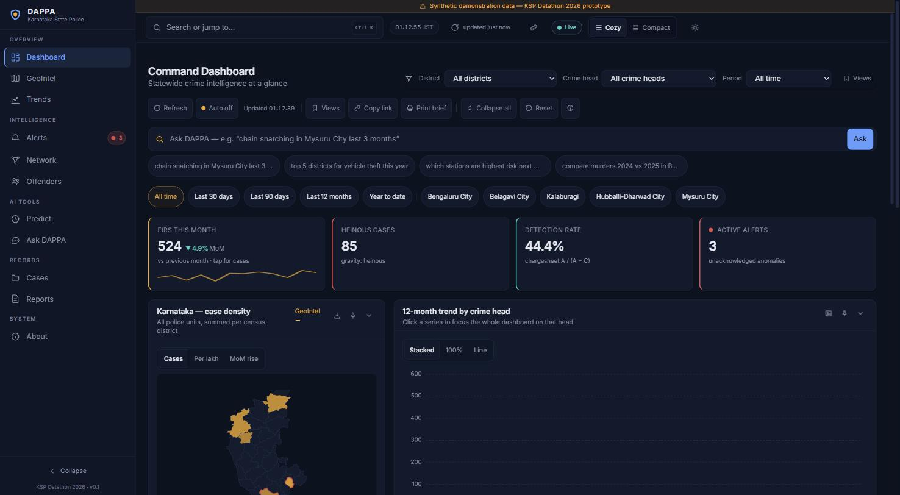
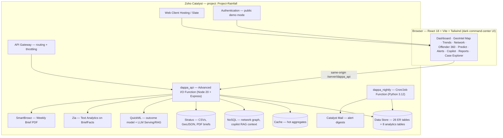

# KSP DAPPA

**Karnataka State Police — Data Analytics & Predictive Policing Assistant**

> *From Records to Foresight.* (ದತ್ತಾಂಶದಿಂದ ದೂರದೃಷ್ಟಿಗೆ)

KSP DAPPA turns the SCRB's siloed, Excel-bound FIR records into a live
strategic-intelligence hub: an interactive geospatial command center that
detects crime hotspots, uncovers hidden criminal networks, resolves repeat
offenders across jurisdictions, forecasts emerging risks, and answers
plain-English questions — built end-to-end on **Zoho Catalyst**, on the
**official KSP FIR database schema**.

Submission for **KSP Datathon 2026**, challenge *"AI-Driven Crime Analytics &
Visualization Platform."*



---

## Highlights

- **905 cataloged features, 324 of them analytic.** Every user-visible
  capability is enumerated in [`FEATURES.md`](FEATURES.md), each tagged with the
  scored capabilities it serves or marked infrastructure; the counts below are
  derived from those tags and checked in CI.
- **Official ER schema, verbatim.** Every table, key, and the structured
  `CrimeNo` format (`1-digit category · 4-digit district · 4-digit station ·
  4-digit year · 5-digit serial`) from the organizer-supplied ER diagram is
  implemented in Catalyst Data Store — the FIR detail view even renders the
  18-digit breakdown.
- **Identity resolution across jurisdictions.** The Accused table has no person
  ID (faithful to the real schema); DAPPA links "Ravi Kumar", "Ravi Kumar B"
  and "R Kumar" across districts into one Offender-360 profile with an MO
  signature — the "impossible in isolated Excel sheets" moment, made visible.
- **Catalyst-native maximalism.** 28 Catalyst services mapped by
  `GET /meta/services`, 23 with a real call site; on the deployed build 9 are
  live and 5 more are active behind a flag (checked 27 Aug 2026 — the rest
  name the console step that flips them); no external AI, hosting, database,
  or auth service anywhere.
- **Demo-proof AI.** Heavy analytics (DBSCAN hotspots, Louvain communities,
  Holt-Winters forecasts) are precomputed into Data Store tables; live AI
  (QuickML, Zia, LLM/RAG copilot) sits behind feature flags with
  identical-shape local fallbacks — the app can never error mid-demo.

## Architecture



**Data flow:** the Python synthetic-data engine generates ER-faithful records →
bulk-loaded into Data Store → the analytics pass persists derived intelligence
(aggregates, hotspots, forecasts, anomalies, network, offender profiles,
station risk) → the API serves precomputed intel in milliseconds via Cache →
the UI renders. Live AI calls are on-demand, flag-gated, with fallbacks.

## Features

| Challenge requirement | DAPPA screen | How |
|---|---|---|
| Interactive geospatial dashboards | Command Dashboard + GeoIntel Map | Choropleth of 38 police units, district → station → FIR drill-down |
| Spatiotemporal hotspots | Hotspot layer | ST-DBSCAN over lat/lng × hour-of-day ("Night burglary belt — Peenya, 11PM–3AM") |
| Emerging-trend alerts, red-zone pulsing | Alerts + pulsing map badges | Weekly counts vs 8-week seasonal baseline; z ≥ 2 → animated red pulse |
| Relationship mapping | Network Explorer | Co-accused graph, Louvain communities ("Group #7 · 9 members · 4 districts") |
| Repeat-offender tracking + MO | Offender 360 | Fuzzy identity resolution + MO signature from FIR narratives |
| Socio-economic correlation | Context panel | District crime rates × urbanization/literacy/density, correlation matrix |
| Predictive risk scoring | Predict | 30-day station risk index + QuickML case-outcome model, live |
| Anomaly detection | Alerts + case flags | Robust z-scores + IsolationForest case-level outliers |
| Pattern & trend discovery | Trends | Hour×weekday seasonality, festival-window annotations, forecasts with CI |
| Natural-language analytics | Ask DAPPA copilot | QuickML LLM + RAG, deterministic NL→ZCQL fallback, chart + ZCQL reveal |
| Strategic intelligence delivery | Reports | One-click SmartBrowz Weekly Intelligence Brief PDF, Catalyst Mail digest |

## Challenge coverage

[`CAPABILITIES.md`](CAPABILITIES.md) is the auditable map from the six scored
capabilities of the challenge to the features backing each one — with the
verbatim requirement, the route or endpoint where a judge can see it working,
the numbered feature list from [`FEATURES.md`](FEATURES.md), and an honest count.

| Capability | Features | Bar |
|---|---:|---|
| C1 · Advanced Visualization | 134 | ✅ clears 100 |
| C2 · Criminological Network & Link Analysis | 81 | ❌ short by 19 |
| C3 · Sociological & AI-Driven Predictive Dashboards | 81 | ❌ short by 19 |
| C4 · Pattern & Trend Discovery | 85 | ❌ short by 15 |
| C5 · Network & Behavioural Analysis | 44 | ❌ short by 56 |
| C6 · AI/ML-Driven Intelligence | 52 | ❌ short by 48 |

One capability clears the 100-feature bar under the Round-2 counting rules and
five do not; each gap is named in [§ Shortfall](CAPABILITIES.md#shortfall).
Of the 905 cataloged features, 324 deliver analytic or visual substance
(477 attributions across the six capabilities) and 580 are enabling
infrastructure (app shell, filters, exports, error handling, print plumbing,
i18n) that is deliberately **excluded** from these counts. Nothing is counted
twice in silence: the full [overlap matrix](CAPABILITIES.md#overlap) and the
33 [backend-only endpoints](CAPABILITIES.md#backend-only) are published, and
`node scripts/check_capabilities.mjs` re-derives every number from the catalog
tags so it can be checked rather than taken on trust. These figures are lower
than the July scorecard because the rule is stricter, not because anything
was removed — see [§ What changed](CAPABILITIES.md#what-changed-since-the-last-audit).

## Catalyst services used

The table below is generated from [`functions/dappa_api/lib/servicemap.js`](functions/dappa_api/lib/servicemap.js)
by `node scripts/gen_service_table.mjs`; the contract suite fails if it drifts.
Every row names the call site, so a judge can open the file and the endpoint.

<!-- SERVICES:START — generated by scripts/gen_service_table.mjs from functions/dappa_api/lib/servicemap.js; do not edit by hand -->
**35 Catalyst services** are mapped by `GET /meta/services`; **30** have a real call site in this repository. Against the tracked configuration: 10 live, 8 active behind a flag, 2 platform, 0 flag-gated, 13 console-pending, 2 unavailable in the IN data centre. The deployed truth is always the live endpoint — the `/about` page renders it.

| # | Service | Category | Status | How DAPPA calls it | Console step / flag |
|---|---|---|---|---|---|
| 1 | Serverless Functions | compute | live | functions/dappa_api — Express app exported from index.js | — |
| 2 | Signals + Event Functions | compute | live | functions/dappa_event — AggMonthly upsert + z-check + AnomalyAlert insert | — |
| 3 | Cron / Job Scheduling | compute | live | functions/dappa_nightly — nightly analytics refresh (Python 3.12) | — |
| 4 | AppSail (managed runtime) | compute | console-pending | — (no call site) | not used — the API runs as an advanced-I/O function; no code path can enable AppSail |
| 5 | AppSail (custom OCI runtime) | compute | console-pending | — (no call site) | not used — no custom container is part of this submission |
| 6 | Signals cross-app event bus | compute | console-pending | — (no call site) | only the in-project CaseMaster signal is bound; a cross-app subscription is a console step |
| 7 | Data Store | data | live | lib/datastore.js — buildZCQL + zcql().executeZCQLQuery, paged at 300 rows | — |
| 8 | Data Store full-text Search | data | live | lib/search.js — search().executeSearchQuery over CaseMaster + OffenderProfile | `FEATURE_SEARCH` |
| 9 | NoSQL | data | live | index.js graphLoaders.nosql — nosql().getTable('dappa_network').fetchItem() | — |
| 10 | Stratus (object store) | data | live | index.js — stratus().bucket('dappa').putObject/getObject/generatePreSignedUrl | — |
| 11 | File Store | data | live | lib/artifacts.js — filestore().folder(id).uploadFile/downloadFile | `FEATURE_FILESTORE` |
| 12 | Cache | data | live | lib/cache.js — cache().segment('dappa').put/getValue | — |
| 13 | Data Store OLAP database | data | console-pending | lib/olap.js — zcql().executeOLAPQuery(sql) for the district x head x month cube and the nightly detect step | flag on but OLAP_ENABLED not set |
| 14 | Catalyst Mail | messaging | console-pending | lib/mail.js — email().sendMail({from_email,to_email,subject,content}); the action-loop digest (lib/actiondigest.js) goes through the same sendDigest | flag on but MAIL_FROM, DIGEST_TO not set |
| 15 | Push Notifications | messaging | active (flag on) | lib/push.js — pushNotification().web().sendNotification(message, recipients); an alert escalate/assign action (lib/routes/actionlog.js) pushes through the same sendPush | `FEATURE_PUSH` |
| 16 | Circuits (multi-step orchestration) | orchestration | unavailable in IN DC | lib/circuits.js — circuit().execute(CIRCUIT_ID, 'dappa_nightly_refresh') | Circuits is documented as not available in the IN data centre (docs/CATALYST_SERVICE_RESEARCH.md §3); the in-process fallback serves |
| 17 | Job Scheduling (job pool + retries) | orchestration | active (flag on) | lib/jobs.js — jobScheduling().job().submitJob({target_type:'Function', target_name:'dappa_nightly', jobpool_name, job_config:{number_of_retries, retry_interval}}) / getJob(id) | `FEATURE_JOBS` |
| 18 | Zia Services (text analytics) | ai | active (flag on) | lib/zia.js — zia().getNERPrediction/getKeywordExtraction/getSentimentAnalysis | `FEATURE_ZIA` |
| 19 | Zia Services (OCR / scanners) | ai | active (flag on) | lib/zia.js — zia().extractOpticalCharacters(readStream, {language}) | `FEATURE_ZIA_OCR` |
| 20 | Zia Services (translation / speech) | ai | console-pending | lib/zia.js translate() — POSTs ZIA_TRANSLATE_URL (no zcatalyst-sdk-node binding in v3.4.0) | flag on but ZIA_TRANSLATE_URL not set |
| 21 | Zia Face Analytics (detection quality gate) | ai | active (flag on) | lib/faces.js qualityGate() — zia().analyseFace(readStream, {mode:'moderate'}) before any comparison | `FEATURE_FACE_ID` |
| 22 | Zia Identity Scanner (1:1 face comparison) | ai | active (flag on) | lib/faces.js ziaCompare() — zia().compareFace(galleryStream, probeStream) per shortlisted candidate (≤ FACE_ZIA_MAX_COMPARES, cached 24 h) | `FEATURE_FACE_ID` |
| 23 | Zia AutoML (tabular) | ai | unavailable in IN DC | lib/zia.js automlPredict() — zia().automl(ZIA_AUTOML_MODEL_ID, features) | Zia AutoML is documented as not available in the IN data centre (docs/CATALYST_SERVICE_RESEARCH.md §5); the in-process fallback serves |
| 24 | QuickML (no-code ML pipelines) | ai | console-pending | lib/quickml.js — quickML().predict(QUICKML_STATUS_ENDPOINT_KEY, CaseMaster columns) for case status; QUICKML_ENDPOINT_KEY / deployment URL for the A-vs-C outcome model | flag on but QUICKML_STATUS_ENDPOINT_KEY not set |
| 25 | QuickML LLM Serving + RAG | ai | console-pending | lib/routes/actions.js — POSTs QUICKML_LLM_URL with the copilot question | flag on but QUICKML_LLM_URL not set |
| 26 | SmartBrowz (PDF / screenshots) | ai | active (flag on) | index.js smartbrowz.renderBrief — smartbrowz().convertToPdf(printUrl) then Stratus put + pre-signed URL; lib/artifacts.js captureMapSnapshot — smartbrowz().takeScreenshot(mapUrl, {page_options, screenshot_options}) | `FEATURE_SMARTBROWZ` |
| 27 | Zia Services (object recognition / image moderation) | ai | active (flag on) | lib/objects.js — zia().detectObject(readStream); lib/moderation.js — zia().moderateImage(readStream, {mode}) | `FEATURE_ZIA_OBJECTS` |
| 28 | QuickML AutoML challenger | ai | console-pending | lib/challenger.js — quickML().predict(QUICKML_AUTOML_ENDPOINT_KEY, features) beside the embedded logistic champion | flag on but QUICKML_AUTOML_ENDPOINT_KEY not set |
| 29 | Catalyst Authentication | platform | live | lib/auth.js — userManagement().getCurrentUser() / getAllUsers() | `FEATURE_AUTH` |
| 30 | Connections (OAuth) | platform | console-pending | lib/routes/services.js — connections().getConnectionCredentials(CONNECTION_LINK_NAME) | flag on but CONNECTION_LINK_NAME not set |
| 31 | Slate / Web Client Hosting | platform | platform | client/dist deployed as the project web client (catalyst deploy) | — |
| 32 | API Gateway | platform | platform | app mounts both /api/v1 and /server/dappa_api/api/v1 so either routing shape resolves | — |
| 33 | Domain Mappings | platform | console-pending | — (no call site) | console-only step; the app runs on the default Catalyst domain |
| 34 | DevOps: APM + Logs | platform | console-pending | lib/observability.js — request ring buffer behind /meta/observability (Catalyst APM/Logs are console-read only; lib/apminsight in the SDK is the Site24x7 agent and needs a Site24x7 key) | enable APM under DevOps > APM in the console and set APM_ENABLED=on; /meta/observability serves in-function telemetry meanwhile |
| 35 | Pipelines (CI/CD) | platform | console-pending | — (no call site) | deployment is driven by catalyst deploy; a Pipeline is a console/repo integration step |

*Status vocabulary:* **live** — called on the default request path; **active** — flag on and configured; **flag-gated** — code path exists, flag off; **console-pending** — needs a console step no code can perform (the reason names it); **platform** — the project runs on it without an SDK call from the function; **unavailable in IN DC** — the Catalyst docs list the service as not offered in the IN data centre this project runs in, so no console step can enable it (the reason cites the research page).
<!-- SERVICES:END -->

Not yet used, honestly: **ConvoKraft** (a guided-dialogue alternative to the
Ask DAPPA copilot) is on the roadmap; nothing in the code calls it.

## Quickstart

### Prerequisites

- **Node ≥ 20** and npm
- **Python 3.12** — on this project's dev machine the interpreter is invoked as
  `python3.12` (plain `python` may resolve elsewhere); packages: pandas, numpy,
  scikit-learn, networkx, scipy, statsmodels, rapidfuzz, faker
- **Catalyst CLI** ≥ 1.27 (`npm i -g zcatalyst-cli`), logged in
  (`catalyst login`) with access to the Catalyst project

### 1. Generate the synthetic dataset + analytics

```bash
python3.12 pipeline/generate.py            # ~45k FIRs, deterministic (--seed 2026)
python3.12 pipeline/analytics.py           # hotspots, forecasts, anomalies, network, risk
```

Scale down with `DAPPA_SCALE=15000` if imports are slow. Outputs land in
`pipeline/out/` (one CSV per Data Store table + QuickML training files +
RAG context).

### 2. Bulk-load the Data Store

```bash
node scripts/bulk_load.js                  # resumable; skips tables already loaded
node scripts/verify_load.mjs               # row counts vs CSVs + 5 spot joins
```

### 3. Run locally

```bash
cd client && npm install && cd ..
catalyst serve                             # app on :3000, API under /server/dappa_api
node scripts/smoke_test.mjs http://localhost:3000
```

### 4. Deploy

```bash
cd client && npm run build:catalyst && cd ..
node scripts/deploy.mjs                    # catalyst deploy with secrets injected from
                                           # functions/dappa_api/.env.deploy (never committed)
node scripts/warmup.mjs <deployed URL>     # prime the cache
node scripts/smoke_test.mjs <deployed URL> # full smoke suite (must be green)
```

`node scripts/deploy.mjs` exists because `catalyst deploy` ships the tracked
`catalyst-config.json` verbatim: every credential in that file is an empty
string in git, and the wrapper fills them from an untracked `.env.deploy` for
the duration of the deploy only. Console steps for each live Catalyst service
(QuickML, LLM/RAG, Zia, SmartBrowz, Mail, Circuits, Search columns, Production)
are in [`docs/CONSOLE_SETUP.md`](docs/CONSOLE_SETUP.md); until a step is done
the service reports `console-pending` on `GET /meta/services` and its
documented fallback serves.

Once per clone, enable the commit gate (tree hygiene + generated tables):

```bash
git config core.hooksPath scripts/hooks
```

## Environment variables

Set on the `dappa_api` function (console → Functions → dappa_api →
Configuration, or locally in `functions/dappa_api/.env.deploy` for
`scripts/deploy.mjs`). The table is generated from `lib/servicemap.js` and
`lib/flags.js` by `node scripts/gen_service_table.mjs`. Every `FEATURE_*` flag
ships **on** in the tracked config; a flag whose prerequisite is still empty
reports `console-pending` and the fallback serves — nothing errors.

<!-- ENV:START — generated by scripts/gen_service_table.mjs; do not edit by hand -->
| Variable | Kind | Controls | Default / where it is set |
|---|---|---|---|
| `FEATURE_SEARCH` | flag | Data Store full-text Search — off → ZCQL LIKE across the same columns, merged and deduped | default on; tracked config `on` |
| `FEATURE_FILESTORE` | flag | File Store — off → Stratus bucket, then an in-process memory store | default on; tracked config `on` |
| `FILESTORE_FOLDER_ID` | prerequisite | File Store; empty ⇒ `console-pending` | console step (see docs/CONSOLE_SETUP.md); set via `.env.deploy` |
| `FEATURE_OLAP` | flag | Data Store OLAP database — off → the identical structured query through the paged 300-row ZCQL path (executeZCQLQuery) | default off; tracked config `on` |
| `OLAP_ENABLED` | prerequisite | Data Store OLAP database; empty ⇒ `console-pending` | console step (see docs/CONSOLE_SETUP.md); set via `.env.deploy` |
| `FEATURE_MAIL` | flag | Catalyst Mail — off → the fully rendered digest is returned as `preview` and logged; the action-loop digest is also served as JSON and the printable /alerts/digest page | default off; tracked config `on` |
| `MAIL_FROM` | prerequisite | Catalyst Mail; empty ⇒ `console-pending` | console step (see docs/CONSOLE_SETUP.md); set via `.env.deploy` |
| `DIGEST_TO` | prerequisite | Catalyst Mail; empty ⇒ `console-pending` | console step (see docs/CONSOLE_SETUP.md); set via `.env.deploy` |
| `FEATURE_PUSH` | flag | Push Notifications — off → no-op that logs the payload and returns it as `preview`; the in-app notification centre reads the same events from /actions/recent | default off; tracked config `on` |
| `FEATURE_CIRCUIT` | flag | Circuits (multi-step orchestration) — off → Job Scheduling (lib/jobs.js, FEATURE_JOBS) submits the same nightly refresh with retries; without a job pool the identical aggregate -> detect-anomalies -> notify steps run sequentially in-process | default off; tracked config `on` |
| `CIRCUIT_ID` | prerequisite | Circuits (multi-step orchestration); empty ⇒ `console-pending` | console step (see docs/CONSOLE_SETUP.md); set via `.env.deploy` |
| `FEATURE_JOBS` | flag | Job Scheduling (job pool + retries) — off → the same three nightly steps run inline (lib/circuits.js runInline) and are reported in the job shape | default off; tracked config `on` |
| `JOB_POOL_NAME` | prerequisite | Job Scheduling (job pool + retries); empty ⇒ `console-pending` | console step (see docs/CONSOLE_SETUP.md); set via `.env.deploy` |
| `FEATURE_ZIA` | flag | Zia Services (text analytics) — off → deterministic MO-vocabulary + TF extractor | default off; tracked config `on` |
| `FEATURE_ZIA_OCR` | flag | Zia Services (OCR / scanners) — off → analyse caller-supplied text with ocrAvailable:false | default off; tracked config `on` |
| `FEATURE_ZIA_TRANSLATE` | flag | Zia Services (translation / speech) — off → pinned English↔Kannada domain glossary; unknown strings pass through untranslated | default off; tracked config `on` |
| `ZIA_TRANSLATE_URL` | prerequisite | Zia Services (translation / speech); empty ⇒ `console-pending` | console step (see docs/CONSOLE_SETUP.md); set via `.env.deploy` |
| `FEATURE_FACE_ID` | flag | Zia Face Analytics (detection quality gate) — off → advisory gate (decodable still image, dimensions, aspect) with gate.mode:'advisory' — never a fake detection | default off; tracked config `on` |
| `FEATURE_FACE_ID` | flag | Zia Identity Scanner (1:1 face comparison) — off → local descriptor engine — cosine similarity over the generator's parameter space (meta.engine local-descriptor) | default off; tracked config `on` |
| `FEATURE_ZIA_AUTOML` | flag | Zia AutoML (tabular) — off → the embedded logistic outcome model | default off; tracked config `on` |
| `ZIA_AUTOML_MODEL_ID` | prerequisite | Zia AutoML (tabular); empty ⇒ `console-pending` | console step (see docs/CONSOLE_SETUP.md); set via `.env.deploy` |
| `FEATURE_QUICKML` | flag | QuickML (no-code ML pipelines) — off → the embedded logistic outcome model (A vs C only — case status has no local twin) | default off; tracked config `on` |
| `QUICKML_STATUS_ENDPOINT_KEY` | prerequisite | QuickML (no-code ML pipelines); empty ⇒ `console-pending` | console step (see docs/CONSOLE_SETUP.md); set via `.env.deploy` |
| `FEATURE_QUICKML_LLM` | flag | QuickML LLM Serving + RAG — off → deterministic copilot parser over live ZCQL aggregates | default off; tracked config `on` |
| `QUICKML_LLM_URL` | prerequisite | QuickML LLM Serving + RAG; empty ⇒ `console-pending` | console step (see docs/CONSOLE_SETUP.md); set via `.env.deploy` |
| `FEATURE_SMARTBROWZ` | flag | SmartBrowz (PDF / screenshots) — off → print-CSS route the browser prints itself; the static map image in place of the screenshot | default off; tracked config `on` |
| `FEATURE_ZIA_OBJECTS` | flag | Zia Services (object recognition / image moderation) — off → the scene generator's own manifest tags (source:fixture) and a format/size check with verdict:unscreened | default off; tracked config `on` |
| `FEATURE_QUICKML_AUTOML` | flag | QuickML AutoML challenger — off → champion only; the challenger AUC is read from QUICKML_AUTOML_AUC (copied from the console), never computed here | default off; tracked config `on` |
| `QUICKML_AUTOML_ENDPOINT_KEY` | prerequisite | QuickML AutoML challenger; empty ⇒ `console-pending` | console step (see docs/CONSOLE_SETUP.md); set via `.env.deploy` |
| `FEATURE_AUTH` | flag | Catalyst Authentication — off → anonymous demo identity, with the admin token as the elevation path | default on; tracked config `on` |
| `FEATURE_CONNECTIONS` | flag | Connections (OAuth) — off → reports the missing connection instead of calling out; no feature depends on it | default off; tracked config `on` |
| `CONNECTION_LINK_NAME` | prerequisite | Connections (OAuth); empty ⇒ `console-pending` | console step (see docs/CONSOLE_SETUP.md); set via `.env.deploy` |
| `APM_ENABLED` | prerequisite | DevOps: APM + Logs; empty ⇒ `console-pending` | console step (see docs/CONSOLE_SETUP.md); set via `.env.deploy` |
| `QUICKML_STATUS_ENDPOINT_KEY` | prerequisite | QuickML case-status Random Forest endpoint (`POST /predict/case-status`) | published endpoint key; set via `.env.deploy`, never committed |
<!-- ENV:END -->

| Variable (not service-bound) | Meaning |
|---|---|
| `PUBLIC_DEMO` | `true` (default) = read-only anonymous access for judges; admin actions gated behind a Catalyst session or the admin token |
| `ORG_ID` | Catalyst org id, mirrored into `X_ZOHO_CATALYST_ORG_ID` at boot because the SDK needs it to send `CATALYST-ORG` to QuickML |
| `APP_BASE_URL` | Public base URL of the web client; SmartBrowz renders the printable brief from it |
| `STRATUS_BUCKET` | Stratus bucket holding the graph snapshot, rendered briefs and archived artefacts |
| `AI_TIMEOUT_MS` | Per-call timeout for every live AI service before the fallback answers (default 4000) |
| `FORCE_FIXTURE_TABLES` | Comma-separated tables to answer from the bundled fixture while a load is incomplete (empty in normal operation) |
| `DAPPA_SCALE` | Generator scale knob (default 45000 cases) |
| `DAPPA_OUT` | Pipeline input/output dir (default `pipeline/out`) |
| `VITE_API_BASE` | Client dev override for the API base (default `/server/dappa_api/api/v1`) |

## API overview

Base path: `/server/dappa_api/api/v1`. Envelope: `{"ok":true,"data":…,"meta":…}`
(errors: `{"ok":false,"error":{code,message}}`). Common filters
`from,to,districtId,unitId,crimeHeadId,crimeSubHeadId,gravityId`; pagination
`page`/`perPage` (≤200). The API registers **74 distinct routes**; the ones
below are the analytic core, and the full list with the service each one
exercises (`/meta/services`, `/search/cases`, `/zia/*`, `/ml/models`,
`/admin/circuit/*`, `/auth/*`, `/notify/*`, `/reports/artifacts`…) is in
[`docs/CONTRACTS.md`](docs/CONTRACTS.md). Every route is exercised by the
contract suite (`npm test` in `functions/dappa_api`, 800+ checks).

| Endpoint | Purpose |
|---|---|
| `GET /healthz` | Data Store / Cache / NoSQL reachability + row counts |
| `GET /meta/lookups` | Districts, unit hierarchy, crime heads/subheads, statuses (cached 1 h) |
| `GET /summary/kpis` | Total FIRs, MoM %, heinous, detection rate, active alerts, top riser |
| `GET /trends/monthly` · `/trends/seasonality` · `/trends/category-share` | Trend lines, hour×weekday matrix, category share |
| `GET /geo/districts` · `/geo/stations` · `/geo/incidents` · `/geo/hotspots` | Choropleth, station bubbles, heat points, hotspot clusters |
| `GET /alerts` · `POST /alerts/:id/ack` | Emerging-trend anomaly alerts + acknowledge |
| `GET /network/graph` | Co-accused network (nodes/edges, communities) |
| `GET /offenders` · `/offenders/:personKey` | Identity-resolved offender profiles + Offender 360 |
| `GET /forecast` | History + 3-month forecast with 80% CI + backtest MAPE |
| `GET /risk/stations` | Next-30-day station risk scores with drivers |
| `GET /cases` · `/cases/:id` | Case explorer + full-ER FIR detail |
| `POST /predict/outcome` | Chargesheet A-vs-C probability (calibrated embedded logistic model) |
| `POST /predict/case-status` | Case status via the published QuickML Random Forest; `503` if the deployment is unreachable — never a substituted answer |
| `POST /ai/narrative` | Zia NER/keywords/sentiment on `BriefFacts` |
| `POST /copilot/query` | Ask-DAPPA natural-language analytics |
| `POST /reports/weekly-brief` | SmartBrowz PDF of the weekly intelligence brief |

## Data ethics & disclaimer

- **All data is synthetic.** Generated by `pipeline/generate.py` (deterministic,
  seed 2026) with fictional Kannada-region names; no real person, case, or
  record is represented. A visible banner in the UI states this at all times.
- **Caste and religion are never model inputs.** These fields exist in the
  schema for fidelity to the official ER diagram, but are excluded from every
  ML feature set, analytics output, and UI analytics — by contract, enforced in
  the pipeline and API.
- District boundaries are 2011-census polygons; socio-economic figures are
  indicative census-like values, labelled as such in the UI.

## Repository layout

```
client/            React 18 + Vite + Tailwind SPA (command-center UI, English · ಕನ್ನಡ)
functions/
  dappa_api/       Advanced I/O function — Node 20 + Express REST API (74 routes) + contract suite
  dappa_event/     Event function — CaseMaster insert signal → AggMonthly upsert + z-check
  dappa_nightly/   Cron/Job function — Python analytics refresh
pipeline/          generate.py (synthetic ER data) + analytics.py (derived intel)
data/geo/          Karnataka districts GeoJSON (23 KB, 30 features)
scripts/           bulk_load.js · verify_load.mjs · smoke_test.mjs · warmup.mjs · deploy.mjs ·
                   gen_service_table.mjs · check_i18n.mjs · check_tree_hygiene.mjs · hooks/
docs/              DECISIONS.md · ROADMAP.md · CONTRACTS.md · CONSOLE_SETUP.md · benchmarks/ ·
                   screenshots/ · ROUND2_BASELINE.md (engineering docs; strategy kit stays local)
video/script/      Narration, timeline and subtitles of the 3-minute demo video
FEATURES.md        Catalog of user-visible features, tagged by scored capability
CAPABILITIES.md    Audited map from the six scored capabilities to the features behind them
```

## License

MIT — see [`LICENSE`](LICENSE). The repository is public per datathon rules;
the MIT license keeps reuse rights clear.

## Team

<!-- Team section — fill before submission -->
| Name | Role | Contact |
|---|---|---|
| _TBD_ | Team lead | _TBD_ |

---

*KSP Datathon 2026 · built on Zoho Catalyst · synthetic demonstration data only.*
